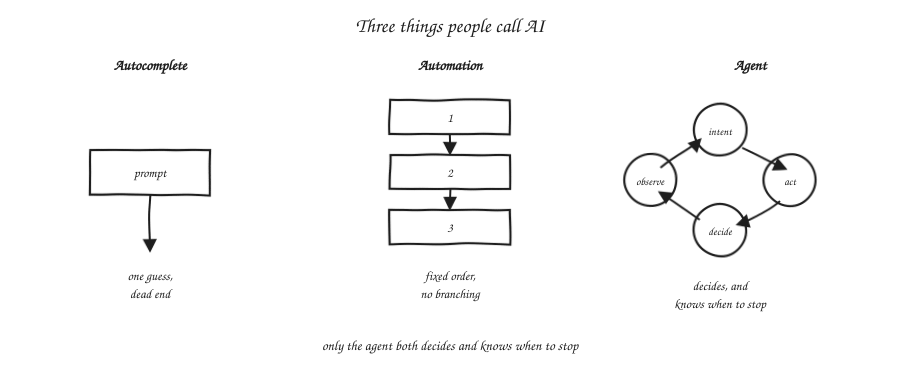
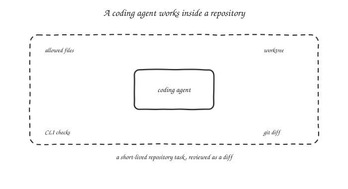
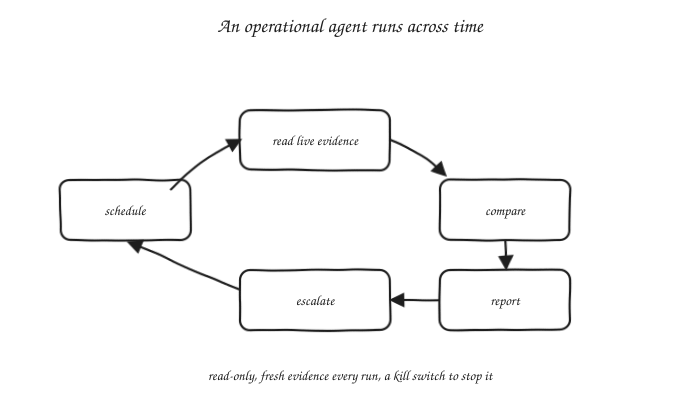
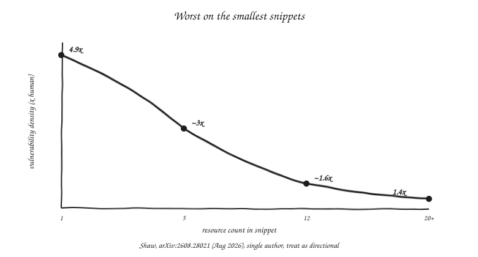
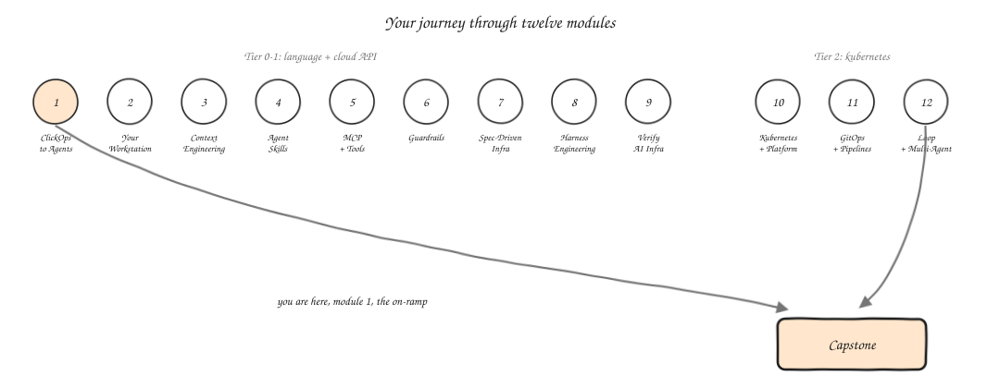

import Slides from '@site/src/components/Slides';
import Embed from '@site/src/components/Embed';

# Chapter 1: From ClickOps to Agents

<Slides src="decks/m01-clickops-to-agents.html" title="M1: From ClickOps to Agents" />

## How Infrastructure Automation Evolved

### The server nobody can rebuild

Every infrastructure team has one of these. A box, or a stack, or a cluster, that one
person built two years ago, under deadline. They never wrote it down. That person left
the company last spring. The runbook says "SSH in and restart the service." Nobody
remembers which service, or why it needs restarting every few weeks in the first place.
Everyone is afraid to touch it. Everyone touches it anyway, because it still runs
production.

There's an old name for this box: a **snowflake server**. Every one is unique, built up
over months or years from a long trail of manual changes, and no two snowflakes are the
same. Nobody sits down and designs a snowflake on purpose. It happens one small step at a
time: a package installed by hand to unblock a deploy on a Friday, a config edited
directly on the box during an incident at 2 a.m., a one-line fix run over SSH and never
written down anywhere else. None of that requires a mouse. Most of it is a shell prompt
and a person who knows the command. ClickOps, clicking through a console, is one way a
server turns into a snowflake. Plain CLI work, typed by hand, one-off, undocumented, builds
the exact same trap, and for most teams it is the more common one.

This is not a story about one bad engineer. It is the normal end state of infrastructure
work done by hand, whether that hand is on a mouse or a keyboard. It is also the starting
point for this whole book. Every era of infrastructure automation you are about to read
about was invented to fix some version of that server. And every one of those fixes left
behind a smaller, different version of the same problem.

### Seven eras, one pattern

Here is the pattern you will see seven times in a row: someone finds a way to state
intent at a higher level, and hands more of the translation work to a machine. The
bottleneck does not disappear. It just moves.

**ClickOps** is where infrastructure work starts for almost everyone. That is a console, a
mouse, a person clicking through a cloud provider's web UI to create a server or a
database. It works. It is also completely undocumented by default, because a click leaves
no file behind. It does not repeat itself the same way twice. Ask two engineers to set up
"the same" server by hand, a week apart, and you would get two different servers.

**Scripts** were the first fix. Shell scripts ran the same commands every time, saved in a
file, checked into version control. Now the setup was documented and repeatable. But a
script is a sequence, not a description. It fails halfway through and leaves the system in
a state nobody planned for. Run it twice on a server that is already configured, and it
usually breaks something, because it was written to build a fresh server, not to update
one that already exists.

**Configuration management** tools, Puppet, Chef, Ansible, and others, fixed that "runs
twice" problem. You describe the state you want on a server: a package installed, a file
present, a service running. The tool checks what is already true, and only changes what
is not. That property has a name: idempotency. It is why configuration management tools
became the default for years. Run the same playbook a hundred times, get the same end
state every time. What these tools did not solve was drift between environments, because
they manage one machine at a time, not the relationships between machines. The list of
which servers even exist still lived in someone's head, or a spreadsheet.

**Declarative infrastructure as code**, Terraform and its relatives, moved the description
up one more level. Instead of describing the state of one server, you describe the state
of your whole environment, the servers, the network, the load balancers, the database, as
one set of files. The tool works out what to create, change, or destroy, so that reality
matches the files. This is a real step up: the files are now the source of truth for the
layout of your environment, not just one machine's setup. What it left behind is state.
Terraform has to track what it already created, somewhere. If that record drifts from
reality, because someone made a manual change, or two people ran `apply` from two
different laptops, the next plan can be wrong in ways that are hard to catch before they
happen.

**GitOps** answered that by moving the source of truth into a place with a history and a
review step: the infrastructure files live in a Git repository, and a controller running
inside the environment keeps checking the running system against whatever is in that
repository. Nobody applies from a laptop anymore. Every change is a commit, every commit
is reviewable, and drift gets corrected automatically because the controller never stops
checking. What GitOps left behind is scale. It solved *how* a change gets applied safely.
It did not solve *how many* changes a team can review well. As the number of repositories
grows, and the pace of change grows with it, the humans doing the reviewing become the new
bottleneck.

**AI-assisted infrastructure**, autocomplete in your editor, a chat window where you paste
in a Terraform error and get a fix back, sits on top of all of that. It is genuinely
useful. It is also where a lot of teams are stuck today: a human still drives every step,
decides what to build, writes or approves each snippet, and runs each command by hand. The
AI makes typing faster. It does not close the loop.

**Agentic** infrastructure is the era this course teaches. It is the first one where a
system can run that whole loop by itself: read an intent, generate infrastructure code,
check it, fix what is wrong, and stop only when the work is actually done, not just when a
human gets tired of prompting. That is a real jump in what is possible. It is also, as you
will see again and again in this book, a jump in how much can go wrong before a human even
notices. That is why almost every module after this one is about building something that
catches the agent before any real damage lands.

Read those seven again, as one line: each era let a human state intent at a higher level,
and handed more of the translation work to a machine. And each one's leftover mess, drift,
sprawl, unreviewed state, too much to review, became the reason the next era got invented.
Agentic infrastructure is not an exception to that pattern. It is simply the next turn of
it. The question this book keeps returning to is: what mess does *this* era leave behind,
and what has to exist to clean it up before it piles up the way every earlier mess did?

### What each era fixed, and what it left behind

Look at the same seven steps a second time, and you can name the trade at each one:
ClickOps traded speed for a record of what happened. Scripts traded repeatability for
safety on a second run. Configuration management traded safety on a second run for a
shared view across machines. Declarative IaC traded a shared view for a state file that
can drift. GitOps traded that drift for a review queue that can overflow. AI-assisted work
traded typing speed for a human still driving every step. Each fix is real. Each fix is
also incomplete, in a way that becomes the next era's whole reason to exist.

### Two things keep rising

Two arrows point the same direction across all seven eras. The first: intent keeps moving
up. You used to describe individual commands. Now you describe a desired end state, and
soon, an outcome you want, in plain language. The second, and this is the one people miss:
the work does not disappear, it moves from *writing* to *verifying*. You spend less time
typing infrastructure code by hand, and more time checking whether what got generated,
by a human or by a machine, is actually correct, safe, and cheap enough to run. Keep that
second arrow in mind. It explains most of the second half of this course.

## What Is an Agent? Loop, Not Autocomplete, Not a Script

The word "agent" gets used loosely right now, for anything from a chat autocomplete to a
fully autonomous pipeline. So before you go further, it is worth pinning down a definition
that will still be true after the current wave of product names has cycled through twice.

### A working definition

An agent is a loop. That is the whole definition: it takes in an intent, acts using some
set of tools, observes what happened, decides what to do next based on that observation,
and repeats, until it hits a stopping condition. Nothing about a specific vendor, model, or
coding tool is load-bearing in that sentence, and that is the point. This definition
should hold up in two years, even after the products have all changed names twice.

### Three things people call AI

Compare that loop to the two things it most often gets confused with. **Autocomplete**
suggests the next few lines of code based on what you already typed, and then it stops.
There is no loop: it never checks whether its own suggestion was right, and it never tries
again if you reject it. It is one guess, handed back to you. A **script**, even a clever
one, runs a fixed sequence of steps in order. It never decides anything as it goes. If
step three fails, it just fails. It does not look at that failure and choose a different
step four.

An agent does both of the things the other two cannot: it makes real decisions based on
what it observes, and it keeps looping until some condition tells it to stop. Watch that
stopping condition closely. It is the part teams get wrong most often, because "keep going
until the task works" and "keep going until you run out of budget or turns" are two very
different systems to be running, even though they can look identical from the outside for
the first few minutes.

### The stopping condition problem

Here is why this matters in practice. An agent with a clear, testable stopping condition,
"stop when `terraform plan` shows zero changes and `checkov` exits clean", behaves like a
tool. An agent with a vague one, "stop when the infrastructure looks good", behaves like a
liability, because "looks good" is a judgment call the agent is now making on its own,
about a system where mistakes can be expensive and hard to undo. A badly defined stopping
condition is the single most common way an agentic infrastructure run turns into an
expensive mess. Fix the stopping condition before you worry about anything else in the
loop.

### Coding agents and operational agents

Not every agent has the same design. A **coding agent** works inside a repository, on one
short task: read the code, make a change, run the checks, hand you a diff. It stays
inside a worktree, or a set of files it is allowed to touch, and when it is done, you
review it the ordinary way, as a pull request. Almost everything in this course, M02
through M09, is this kind of agent.

An **operational agent** looks different. It runs on a schedule, or in response to an
event, not once but again and again, over time. It reads live evidence, the real state of
a running system, compares that against what is expected, and then reports what it found,
or escalates if something looks wrong. Most of what it does is read-only. Its risk does
not come from which files it can edit, a coding agent's risk, it comes from how much live
access it is given, and how often it gets to use it.

This course spends most of its time on coding agents, since an infrastructure change is
naturally a short repository task. Module 12 is where you meet the second kind, agents
that watch running infrastructure over time instead of editing it once.

## The Autonomy Ladder for Infrastructure Agents

If "agent" is the definition of the loop, the autonomy ladder answers the next, more
practical question: how much of that loop are you actually willing to let run without you
watching? It has six steps. The honest answer, for most teams right now, is that they are
using different steps for different kinds of work, often without ever saying so out loud.

**Step 1, suggest.** The agent proposes text, and a human types it in. This is
autocomplete, strictly speaking, but it is also where a lot of chat-based "AI
infrastructure" work actually lives today: you ask a question, you get an answer, you copy
the part you trust into your own editor. Example: you ask an assistant how to structure a
Terraform module for a three-tier VPC, and you type the module yourself, using its answer
only as a reference.

**Step 2, draft.** The agent writes the files directly, and a human reads every single
line before anything happens. This is the first step where the agent actually produces a
real artifact, not just a suggestion, and it is exactly what M02 in this course has you
doing: you hand an agent a one-line intent, it writes you a Terraform module, and you read
it start to finish before you do anything else with it.

**Step 3, propose with plan.** The agent produces both the code and a plan, that is,
`terraform plan` output showing what will actually change, and a human reads the plan
instead of re-reading every line of code. This is a real, meaningfully lighter review,
because a plan tells you the *effect* of the change, three resources created, one
destroyed, which is often the part you actually care about, rather than the code that
produces that effect.

**Step 4, gated apply.** Automated checks run before anything is applied: a formatter, a
scanner, a policy check. A human approves the plan only after those checks pass. This is
the first step where a machine, not only a human, stands between the agent and production.
M09 in this course is entirely about building that gate well.

**Step 5, supervised autonomy.** The agent loops on its own, generating, checking, and
fixing, across several iterations. A human reviews the outcome, not each individual step.
You come back at the end of a run, and you look at what changed and why, not at every plan
made along the way.

**Step 6, unattended.** The agent runs all the way to a defined stopping condition, with
no human anywhere in the loop. A human reviews exceptions, only when the system flags one.
This is the top of the ladder. It is also the step this course spends the least time
recommending for infrastructure work, for reasons the next two chapters will make clear.

### Every step needs a gate

Here is the one rule that matters more than any single step: **no step is safe without the
gate that makes it safe.** A team running step 5 with no automated checks in front of
`apply` is not more advanced than a team on step 2. It is running step 2's real level of
safety, with step 5's level of exposure, and that is worse, not better. Every module in
this course that moves you a step up this ladder also teaches you the gate that has to
exist first, before you are allowed to climb it.

### Try it: is this an agent?

Try the [Agent Classifier](pathname:///310-agentic-iac-site/sims/agent-classifier-sim.html) on a workflow from
your own work. Toggle whether it loops, whether it decides from what it observes, whether
it has a real stopping condition, then see whether it lands as autocomplete, automation, or
a real agent, and if it's an agent, roughly which step of the ladder it sits on and why.

<Embed src="sims/agent-classifier-sim.html" title="Agent Classifier" />

## Where the AI Infrastructure Industry Actually Stands

It is worth being honest about the gap between what agentic infrastructure can technically
do, and what teams currently trust it to do. That gap is the whole reason guardrails make
up the second half of this course. They are not an afterthought bolted on at the end.

### Three numbers from 2026

The Firefly *State of IaC 2026* survey, a vendor survey, so treat these numbers as
directional rather than exact, found that **46%** of organizations are already running AI
for infrastructure work in production, or in advanced pilots. That is real, mainstream
adoption, not an early-adopter curiosity. But only **34%** of respondents said they would
trust an autonomous system to make changes in production without a human approving each
one first. And when asked what is holding broader trust back, **43%** named the absence of
guardrails as the number one blocker, ahead of cost, ahead of accuracy, ahead of every
other reason on the list.

### Adoption is not trust

Read those three numbers together, and you get the real picture of where the industry
stands: broad adoption, narrow trust, and a specific, named reason for the gap between
them. Teams are not avoiding agentic infrastructure. They are avoiding running it
unattended, because most of them do not yet have the gate that would make that safe. That
gap, between how much teams have adopted and how much they actually trust, is where this
entire course lives.

## Why Infrastructure Is Harder Than Application Code for AI

If agents already write application code reasonably well, why is infrastructure
different? There are four properties, and each one turns a mistake that would be an
annoying bug in an application into something considerably worse in infrastructure.

### Four differences

**No undo.** Delete a customer's row in an application database by mistake, and if you
have backups and a little luck, you can restore it. Delete a VPC, and every resource
inside it goes with it. There is usually no restore button waiting for you. Some
infrastructure mistakes can be recovered from. Some cannot, and the code that made the
mistake has no way to tell you which kind it just made.

**State.** An application, mostly, has no memory between requests, or its memory lives in
a database that is managed separately from the application's own code. Infrastructure
tools carry a memory of what they have already built. If that memory drifts out of sync
with reality, a clean, confident-looking plan can propose exactly the wrong thing,
recreating a resource that already exists, for example, and it will look just as correct
as a plan that actually is.

**Blast radius.** A bug in one function of an application usually breaks that one
function. A bug in a shared network setting can take down every service that depends on
that network, all at once. Infrastructure changes tend to have a blast radius that is much
larger, and much harder to predict just by reading the change on its own, than the
equivalent change in application code would have.

**Silent failure.** This is the one that catches teams off guard the most. A 2026 preprint
studying agent behavior on infrastructure tasks found that agents can "achieve short-term
objectives while leaving non-durable changes, broken invariants, and uncleaned state"
behind them. In plain words: the task the agent was given gets done, the agent reports
success, and something sitting right next to that task quietly breaks, or gets left half
finished. A test suite catches most silent failures in application code. Infrastructure
often has no equivalent test suite at all. A scanner has to be actively looking for exactly
the kind of mess an agent leaves behind, or nobody finds out until it causes a real
incident, weeks later.

This module's own lab plants a small, real version of exactly that gap, so you catch it
once by hand before an agent ever hits it for you. **Seeded failure:** a hardcoded AWS
key sitting in the `log_shipper_key` variable's Terraform `default`. **Caught by:**
Checkov's `CKV_SECRET_2` secrets check, on a plan that validates clean and that you'd have to
be reading closely to catch. **Fixed by:** dropping the `default` and marking the variable
`sensitive = true`, so the value has to come from the environment instead.

### The uncomfortable evidence

There is one more piece of evidence worth sitting with, from that same body of research.
At matched resource counts, AI-generated infrastructure code showed roughly **3 to 4
times** the vulnerability density of human-written code doing the same job. Worst on the
smallest snippets, about **4.9 times** on single-resource templates. It fell as the
snippets got bigger, down to around **1.4 times** at twenty or more resources.

This is a single-author, August 2026 preprint, not a peer-reviewed, widely-replicated
finding, and every time it gets cited, including here, it should carry that caveat. But
the pattern of the result is worth taking seriously regardless of the exact multiplier: the
*smallest*, simplest-looking pieces of generated infrastructure were the *least* safe, not
the most. That cuts directly against the natural assumption that a short snippet must be
low-risk, simply because there is less of it to get wrong. The same research found that
asking the model to think for longer, extended thinking, cut that density by only about
13%. Prompting it to reason step by step was not a significant fix either. Better
prompting alone does not close this gap. A gate that checks the actual output does.

## The Core Rule: The Agent Proposes, the Pipeline Decides

Put those four properties, and that survey data, together, and you get the argument this
whole course is built around: **the agent proposes, the pipeline decides.**

### The authority boundary

The agent's job is to generate a good draft: infrastructure code that reflects the intent
it was given, formatted correctly, plausible on first read. That is real, valuable work,
and this book spends a lot of pages on making that draft better, through context, through
skills, through specs. But the agent's authority ends at the plan. It does not get to
decide, on its own, that its own draft is safe enough to apply to a shared, stateful,
high-blast-radius system. Something else makes that call: a pipeline of scanners, policy
checks, cost checks, and a human approval step, using evidence that the agent's own
confidence in its answer plays no part in.

### What this rule does not mean

This is not a claim that agents can never be trusted, stated as some kind of general
principle. It is a narrower, more useful claim: agents are good at generating. Generating
and deciding are different jobs, with different ways of failing. Treat them as one job,
and you get exactly how a plausible-looking plan reaches production without anyone
catching the rule it quietly broke on the way. Keep the two jobs separate, and each one
can improve on its own terms: a better agent proposes better drafts, a better pipeline
catches more of what is wrong with them, and neither improvement has to wait for the other
to happen first.

## Context, Harness, Loop: The Three-Layer Debugging Model

### Three layers

You will build all three of these starting in Module 3, but it is worth previewing the
form of them now, because you will use this as a diagnostic for the rest of the book:
when something about an agentic workflow is not working, which of three layers does the
real problem live in?

The **loop** layer is what re-triggers the agent, and what tells it to stop. If your
symptom sounds like "this works, but I have to babysit every single run", the problem
lives here.

The **harness** layer is the skills, tools, and gates that sit around the agent: hooks,
MCP connections, sandboxing, permission scopes. If your symptom sounds like "this works,
but it keeps ignoring our team's standards", the problem is usually here, not in the model
itself.

The **context** layer is everything the agent knows before it even starts: your
`AGENTS.md` file, the layout of your repository, policy documents, retrieved examples. If
your symptom sounds like "it cannot get one single task right, at all", look here first. A
broken context layer makes the other two layers pointless, because there is no loop worth
running, and no harness worth building, on top of a model that never understood the
problem in the first place.

### Build bottom-up

Build these three layers bottom-up, in that exact order, and never add a loop on top of a
harness you have not fixed yet. That one rule will save you more debugging time across
this course than almost anything else in this chapter.

## What You Will Build in This Course

### Your journey through twelve modules

You now have the vocabulary this entire book uses: the seven eras, the definition of an
agent as a loop, the autonomy ladder, the four reasons infrastructure is a harder problem
for an agent than application code, and the thesis that ties all of it together. Module 2
hands you your first real agentic workstation, Claude Code and Codex, side by side, and
puts you at step 2 of the ladder: the agent drafts, you read every line. Everything after
that is this same loop, one step at a time, with the gate that makes each step safe, built
in before you are ever allowed to climb it.

---

## Vocabulary

| Term | Definition |
|---|---|
| Snowflake server | A server altered by so many small, undocumented manual changes, by mouse or by keyboard, that it is unique and can't reliably be rebuilt |
| ClickOps | Building or changing infrastructure by hand through a console or web UI, with no file recording what was done |
| Configuration management | Tools that describe the desired state of a single machine and only change what doesn't already match it |
| Declarative IaC | Describing the desired state of a whole environment in files, so a tool can work out what to create, change, or destroy |
| GitOps | Keeping infrastructure's source of truth in a Git repository, with a controller that continuously reconciles reality against it |
| Agent | A loop: intent in, act with tools, observe, decide, repeat, until a stopping condition is met |
| Agentic loop | The repeating cycle of acting and observing that defines an agent, as opposed to a single suggestion or a fixed script |
| Coding agent | An agent that works inside a repository on one short task, isolated to a worktree or an allowed file set, reviewed as a diff |
| Operational agent | An agent that runs repeatedly over time, reading live system state and comparing it against what's expected, mostly read-only |
| Stopping condition | The rule that tells an agent's loop when to stop; poorly defined ones are a common source of runaway agent behavior |
| Autonomy ladder | The six-step scale, from suggest to unattended, describing how much of an agentic workflow runs without a human watching each step |
| Gate | An automated or human checkpoint that has to pass before an agent's proposed change is allowed to apply |
| Blast radius | How much of a system is affected when a given change goes wrong |
| Drift | A mismatch between what infrastructure tooling believes is deployed and what's actually running |
| State | The record an infrastructure tool keeps of what it has already created, used to work out what a new plan should change |
| Context engineering | Deliberately shaping what an agent knows before it starts a task, rather than relying on a single prompt |
| Harness | The tools, skills, hooks, and permission scopes that surround an agent and control how it's allowed to act |
| Loop engineering | Designing what re-triggers an agent and what makes it stop |
| Plan gate | A checkpoint where a human or an automated policy reviews a plan's effects before it's applied |
| Spec | A written, specific description of what a piece of infrastructure should do, used to give an agent an unambiguous intent to build against |
