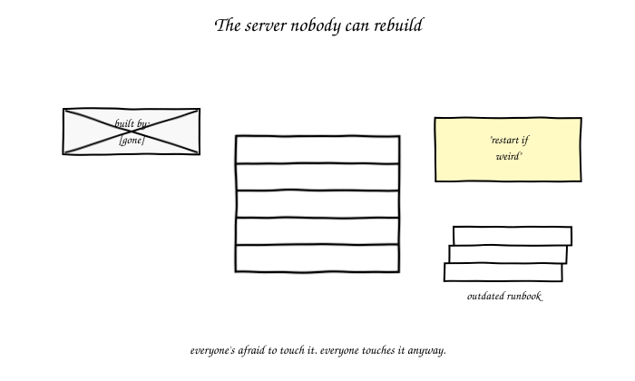
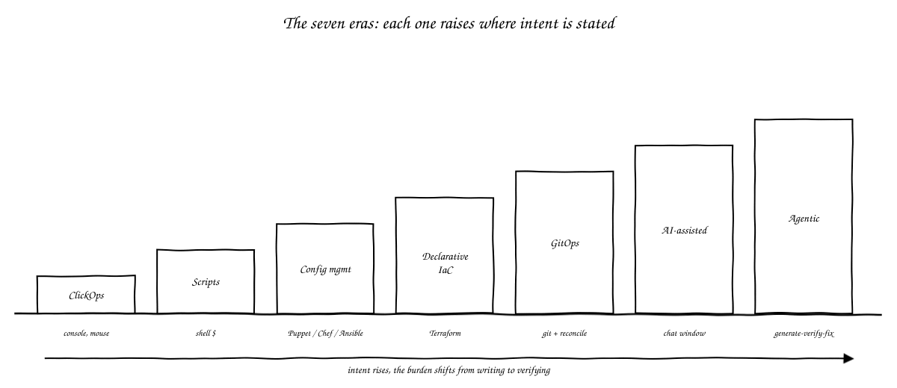
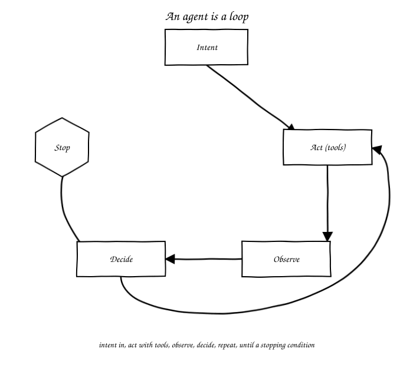
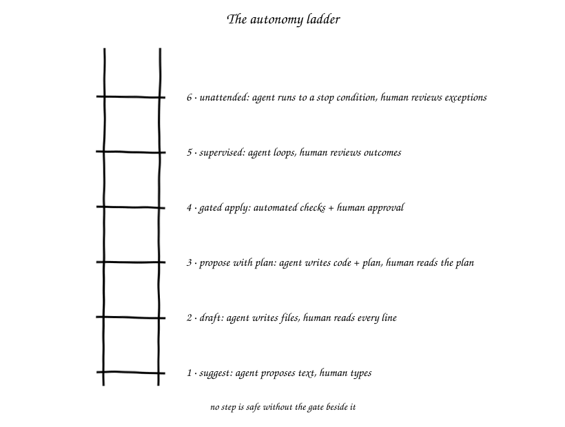
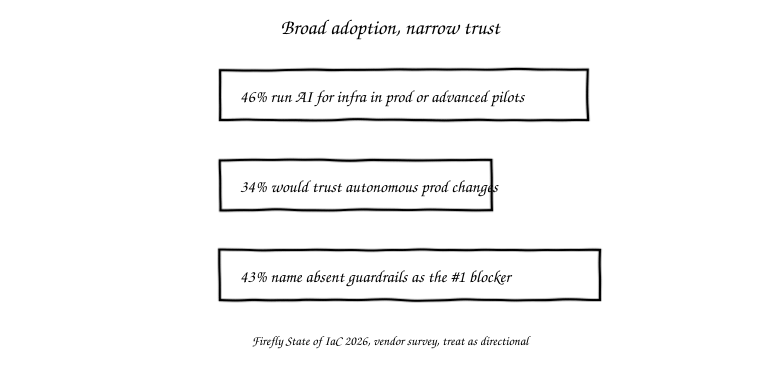
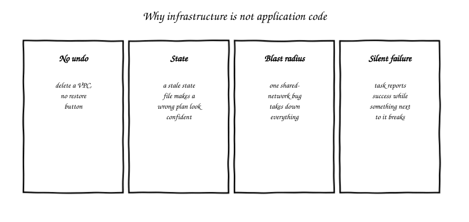
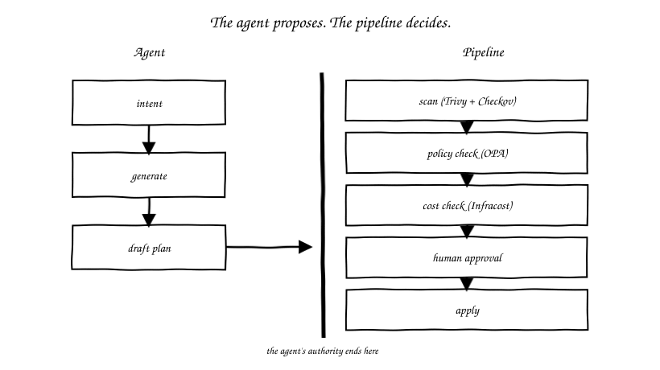
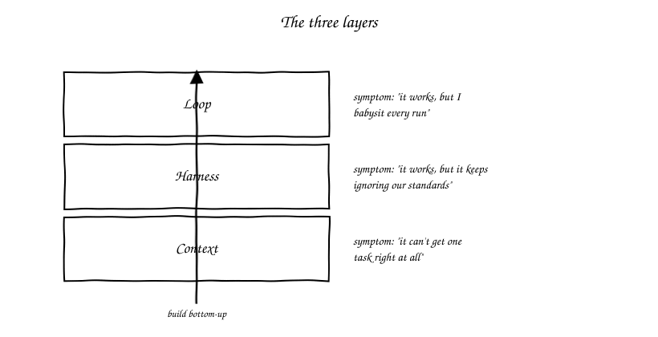

import Slides from '@site/src/components/Slides';

# Chapter 1: From ClickOps to Agents

<Slides src="decks/m01-clickops-to-agents.html" title="M1: From ClickOps to Agents" />

## The server nobody can rebuild

Every infrastructure team has one of these. A box, or a stack, or a cluster, that one
person built two years ago, under deadline. They never wrote it down. That person left
the company last spring. The runbook says "SSH in and restart the service." Nobody
remembers which service, or why it needs restarting every few weeks in the first place.
Everyone is afraid to touch it. Everyone touches it anyway, because it still runs
production.

This is not a story about one bad engineer. It's the normal end state of infrastructure
work done by hand, and it's the starting point for this whole book. Every era of
infrastructure automation we're about to walk through was invented to fix some version of
that server. And every one of those fixes left behind a smaller, different version of the
same problem.

## Seven eras, one through-line

Here's the shape you'll see repeated seven times: someone raises the level at which a
human states intent, and hands more of the translation work to a machine. The bottleneck
moves. It doesn't disappear.

**ClickOps** is where infrastructure work starts for almost everyone: a console, a mouse,
a person clicking through a cloud provider's web UI to create a server or a database. It
works. It's also completely undocumented by default, because a click leaves no file
behind. It doesn't repeat itself the same way twice. Ask two engineers to set up "the
same" server by hand, a week apart, and you'll get two different servers.

**Scripts** were the first fix. Shell scripts ran the same commands every time, saved in
a file, checked into version control. Now the setup was documented and repeatable. But a
script is a sequence, not a description. It fails halfway through and leaves the system
in a state nobody planned for. Running it twice on an already-configured server usually
breaks something, because it was written to build a fresh server, not to update one that
already exists.

**Configuration management** tools, Puppet, Chef, Ansible, and others, fixed the "runs
twice" problem. You describe the desired state of a server: a package installed, a file
present, a service running. The tool figures out what's already true and only changes
what isn't. That property is called idempotency. It's the reason config management tools
became the default for years: run the same playbook a hundred times, get the same end
state every time. What they didn't solve was drift between environments. They manage
individual machines, not the relationships between them. The inventory of which servers
exist still lived in someone's head, or a spreadsheet.

**Declarative infrastructure as code**, Terraform and its relatives, moved the
description up a level again. Instead of describing the state of one server, you
describe the state of your whole environment, the servers, the network, the load
balancers, the database, as one set of files. The tool works out what to create, change,
or destroy to make reality match the files. This is a genuine step up: the files are now
the source of truth for the environment's shape, not just one machine's configuration.
What it left behind is state. Terraform has to track what it created somewhere. If that
state file drifts from reality, because someone made a manual change, or two people ran
`apply` from different laptops, the next plan can be wrong in ways that are hard to spot
before they happen.

**GitOps** answered that by moving the source of truth into a place with a history and a
review process. The infrastructure files live in a Git repository, and a controller
running in the environment continuously reconciles the running system against whatever
is in the repository. No more applying from a laptop. Every change is a commit, every
commit is reviewable, and drift gets corrected automatically because the controller keeps
checking. What it left behind is scale. GitOps solved *how* a change gets applied safely,
not *how many* changes a team can review well. As the number of repositories and the
frequency of change both grow, the humans doing the reviewing become the bottleneck.

**AI-assisted infrastructure**, autocomplete in your editor, a chat window where you
paste in a Terraform error and get a fix back, arrived on top of all of that. It's
genuinely useful. It's also where a lot of teams are stuck today: a human still drives
every step, decides what to build, writes or approves each snippet, and runs each
command. The AI speeds up typing. It doesn't yet close the loop.

**Agentic** infrastructure is the era this course is about. It's the first one where a
system can run that whole loop on its own: read an intent, generate infrastructure code,
check it, fix what's wrong, and stop when it's actually done, not just when a human gets
tired of prompting. That's a real jump in capability. It's also a jump in how much can go
wrong before a human notices, as you'll see over and over in this book. That's why almost
every module after this one is about building something that catches the agent before
the damage lands.

Read those seven again as one line: each era raised the level at which a human states
intent, and handed more of the translation to a machine. And each one's residue, drift,
sprawl, unreviewed state, review overload, became the reason the next era got invented.
Agentic infrastructure is not an exception to that pattern. It's the next turn of it. The
question this book keeps coming back to is what residue *this* era leaves, and what has
to exist to clean it up before it piles up the way all the others did.

## What an agent actually is

The word "agent" gets used loosely right now, for anything from a chat autocomplete to a
fully autonomous pipeline. So it's worth pinning down a definition that will still make
sense after the current wave of product names has cycled through.

An agent is a loop: it takes in an intent, acts using some set of tools, observes what
happened, decides what to do next based on that observation, and repeats, until it hits a
stopping condition. That's the whole definition. Nothing about a specific vendor, a
specific model, or a specific coding tool matters to it. That's the point: this
definition should still be true in two years, even though the products will have changed
names twice by then.

Compare that to the two things people often confuse it with. **Autocomplete** suggests
the next few lines of code based on what you've already typed, and stops. There's no
loop. It doesn't check whether its suggestion was right, and it doesn't try again if you
reject it. It's a single guess, handed back to you. A **script**, even a smart one,
executes a fixed sequence of steps in order. It doesn't decide anything as it goes. If
step three fails, it fails. It doesn't observe the failure and pick a different step four.

An agent does both of the things the other two don't: it makes decisions based on what it
observes, and it keeps looping until some condition says stop. Watch for that stopping
condition specifically. It's the part teams get wrong most often. "Keep going until it
works" and "keep going until you run out of budget or turns" are very different systems.
An agent with a badly defined stopping condition is the single most common way an
agentic infrastructure run turns into an expensive mess.

## The autonomy ladder

If "agent" is the definition of the loop, the autonomy ladder is the answer to the next
question: how much of that loop are you actually willing to let run without you
watching? It's six rungs. The honest answer for most teams right now is that they're
using different rungs for different kinds of work, often without saying so out loud.

**Rung 1, suggest.** The agent proposes text, and a human types it. This is autocomplete,
strictly speaking, but it's also where a lot of chat-based "AI infrastructure" work
actually lives today: you ask a question, you get an answer, you copy the part you trust
into your own editor. Example: you ask an assistant how to structure a Terraform module
for a three-tier VPC, and you type the module yourself, using its answer as a reference.

**Rung 2, draft.** The agent writes the files directly, and a human reads every line
before anything happens. This is the first rung where the agent actually produces
artifacts, not just suggestions. It's exactly what M02 in this course has you doing: you
hand an agent a one-line intent, it writes you a Terraform module, and you read it start
to finish before you do anything else with it.

**Rung 3, propose with plan.** The agent produces both the code and a plan, `terraform
plan` output showing what will actually change, and a human reads the plan rather than
re-reading every line of code. This is a meaningfully lighter review. A plan tells you
the *effect* of the change, three resources created, one destroyed, which is often what
you actually care about, rather than the code that produces that effect.

**Rung 4, gated apply.** Automated checks run before anything is applied: a formatter, a
scanner, a policy check. A human approves the plan once those checks pass. This is the
first rung where a machine, not just a human, stands between the agent and production.
M09 in this course is entirely about building that gate well.

**Rung 5, supervised autonomy.** The agent loops on its own, generating, checking, and
fixing, across multiple iterations. A human reviews outcomes rather than individual
steps. You come back at the end of a run and look at what changed and why, not at every
plan along the way.

**Rung 6, unattended.** The agent runs to a defined stopping condition with no human in
the loop at all. A human reviews exceptions when the system flags one. This is the top of
the ladder. It's also the rung this course spends the least time recommending for
infrastructure work, for reasons that will make more sense once you've read the next
section.

The rule that matters more than any individual rung: **no rung is safe without the gate
that makes it safe.** A team running rung 5 with no automated checks in front of `apply`
isn't more advanced than a team running rung 2. It's running rung 2's level of actual
safety with rung 5's level of exposure. That's worse, not better. Every module in this
course that moves a step up this ladder also teaches the gate that has to exist first.

## Where the industry actually is

It's worth being honest about the gap between what agentic infrastructure can
technically do and what teams currently trust it to do. That gap is the whole reason
guardrails are this course's second half, not an afterthought tacked onto the end.

The Firefly *State of IaC 2026* survey, a vendor survey, so treat the numbers as
directional rather than definitive, found that **46%** of organizations are running AI
for infrastructure work in production or in advanced pilots. That's real, mainstream
adoption, not an early-adopter curiosity. But only **34%** of respondents said they'd
trust an autonomous system to make changes in production without a human approving each
one first. And when asked what's holding broader trust back, **43%** named the absence
of guardrails as the number one blocker, ahead of cost, ahead of accuracy, ahead of
everything else on the list.

Read those three numbers together and you get the actual shape of where things stand:
broad adoption, narrow trust, and a named, specific reason for the gap. Teams aren't
avoiding agentic infrastructure. They're avoiding running it unattended, because most of
them don't yet have the gate that would make that safe. That gap between adoption and
trust is where this entire course lives.

## Why infrastructure is not application code

If agents already write application code reasonably well, why is infrastructure
different? Four properties. Each one turns a mistake that would be an annoying bug in an
application into something considerably worse in infrastructure.

**No undo.** Delete a customer's row in an application database by mistake, and if you
have backups and a bit of luck, you can restore it. Delete a VPC, and every resource
inside it goes with it. There usually isn't a restore button. Some infrastructure
mistakes are recoverable. Some simply aren't, and the code that made the mistake can't
tell you which kind it just made.

**State.** An application, mostly, is stateless between requests, or its state lives in a
database that's managed separately from the application's own code. Infrastructure tools
carry state about what they've already created. If that state gets out of sync with
reality, a clean, confident-looking plan can propose the wrong thing, recreating a
resource that already exists, for instance, and it will look exactly as correct as a
plan that's right.

**Blast radius.** A bug in one function of an application usually breaks that function. A
bug in a shared network configuration can take down every service that depends on that
network at once. Infrastructure changes tend to have a blast radius that's much larger,
and much harder to predict from reading the change in isolation, than the equivalent
change in application code.

**Silent failure.** This is the one that catches teams off guard most often. A 2026
preprint studying agent behavior on infrastructure tasks found that agents can "achieve
short-term objectives while leaving non-durable changes, broken invariants, and uncleaned
state" behind them. In plain words: the task the agent was asked to do gets done, the
agent reports success, and something next to it quietly breaks or gets left
half-finished. A test suite catches most silent failures in application code.
Infrastructure often has no equivalent test suite at all. A scanner has to be looking for
exactly the kind of mess an agent leaves behind, or nobody finds out until it causes an
incident weeks later.

There's a piece of evidence worth sitting with here, from the same body of research. At
matched resource counts, AI-generated infrastructure code showed roughly **3 to 4 times**
the vulnerability density of human-written code covering the same task. Worst on the
smallest snippets, about **4.9 times** on single-resource templates. It fell as the
snippets got bigger, down to around **1.4 times** at twenty or more resources. This is a
single-author, August 2026 preprint, not a peer-reviewed, widely-replicated finding, and
it should be read with that caveat attached every time it's cited, including here. But
the shape of the result is worth taking seriously regardless of the exact multiplier: the
*smallest*, simplest-looking pieces of generated infrastructure were the *least* safe,
not the most. That cuts against the natural assumption that a short snippet is low-risk
because there's less of it to get wrong. The same research found that asking the model to
think more, extended thinking, reduced that density by only about 13%. Prompting for
chain-of-thought reasoning wasn't a significant fix either. Better prompting alone
doesn't close this gap. A gate that checks the output does.

## The thesis

Put those four properties and that survey data together, and you get the argument this
whole course is built around: **the agent proposes, the pipeline decides.**

The agent's job is to generate a good draft: infrastructure code that reflects the
intent it was given, formatted correctly, plausible on first read. That's real, valuable
work, and this book spends a lot of pages on making that draft better, through context,
through skills, through specs. But the agent's authority ends at the plan. It doesn't get
to decide, by itself, that its own draft is safe enough to apply to a shared, stateful,
high-blast-radius system. Something else decides: a pipeline of scanners, policy checks,
cost checks, and a human approval step, using evidence the agent's own confidence in its
answer isn't part of.

This isn't a claim that agents can't be trusted, stated as a matter of principle. It's a
narrower, more useful claim: agents are good at generating. Generating and deciding are
different jobs, with different failure modes. Conflating them is exactly how a
plausible-looking plan gets applied to production without anyone catching the invariant
it quietly broke. Keep them separate, and each one can improve on its own terms: a better
agent proposes better drafts, a better pipeline catches more of what's wrong with them,
and neither improvement depends on the other happening first.

## Three layers, previewed

You'll build all of this out starting in Module 3, but it's worth previewing the shape
now. You'll use it as a diagnostic for the rest of the book: when something about an
agentic workflow isn't working, which of three layers does the problem actually live in?

The **loop** layer is what re-triggers the agent and what tells it to stop. If your
symptom is "this works, but I have to babysit every single run," the problem is here.

The **harness** layer is the skills, tools, and gates around the agent: hooks, MCP
connections, sandboxing, permission scopes. If your symptom is "this works, but it keeps
ignoring our team's standards," the problem is usually here, not in the model.

The **context** layer is everything the agent knows before it starts: your `AGENTS.md`
file, the shape of your repository, policy documents, retrieved examples. If your
symptom is "it can't get one single task right, at all," look here first. A broken
context layer makes the other two layers irrelevant. There's no loop worth running and
no harness worth building on top of a model that doesn't understand the problem it's
been given.

Build these three bottom-up, in that order, and never add a loop on top of a harness you
haven't fixed yet. That single rule will save you more debugging time across this course
than almost anything else in this chapter.

## What's next

You now have the vocabulary this entire book uses: the seven eras, the definition of an
agent as a loop, the autonomy ladder, the four reasons infrastructure is a harder problem
than application code for an agent to touch, and the thesis that ties it together. Module
2 hands you your first real agentic workstation, Claude Code and Codex, side by side, and
puts you at rung 2 of the ladder: the agent drafts, you read every line. Everything after
that is this same loop, one rung at a time, with the gate that makes each rung safe built
in before you're allowed to climb it.

---

## Vocabulary

| Term | Definition |
|---|---|
| ClickOps | Building or changing infrastructure by hand through a console or web UI, with no file recording what was done |
| Configuration management | Tools that describe the desired state of a single machine and only change what doesn't already match it |
| Declarative IaC | Describing the desired state of a whole environment in files, so a tool can work out what to create, change, or destroy |
| GitOps | Keeping infrastructure's source of truth in a Git repository, with a controller that continuously reconciles reality against it |
| Agent | A loop: intent in, act with tools, observe, decide, repeat, until a stopping condition is met |
| Agentic loop | The repeating cycle of acting and observing that defines an agent, as opposed to a single suggestion or a fixed script |
| Stopping condition | The rule that tells an agent's loop when to stop; poorly defined ones are a common source of runaway agent behavior |
| Autonomy ladder | The six-rung scale, from suggest to unattended, describing how much of an agentic workflow runs without a human watching each step |
| Gate | An automated or human checkpoint that has to pass before an agent's proposed change is allowed to apply |
| Blast radius | How much of a system is affected when a given change goes wrong |
| Drift | A mismatch between what infrastructure tooling believes is deployed and what's actually running |
| State | The record an infrastructure tool keeps of what it has already created, used to work out what a new plan should change |
| Context engineering | Deliberately shaping what an agent knows before it starts a task, rather than relying on a single prompt |
| Harness | The tools, skills, hooks, and permission scopes that surround an agent and shape how it's allowed to act |
| Loop engineering | Designing what re-triggers an agent and what makes it stop |
| Plan gate | A checkpoint where a human or an automated policy reviews a plan's effects before it's applied |
| Spec | A written, specific description of what a piece of infrastructure should do, used to give an agent an unambiguous intent to build against |
