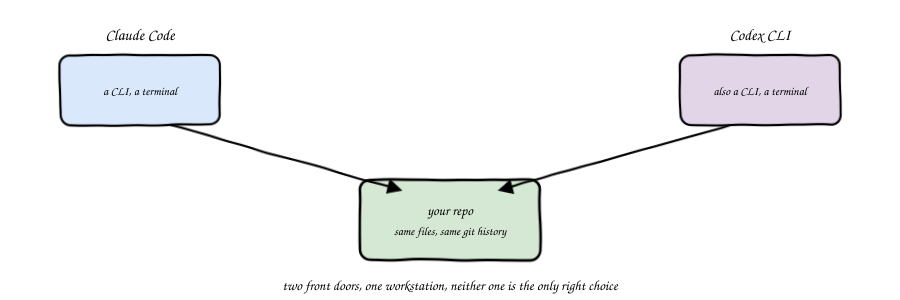
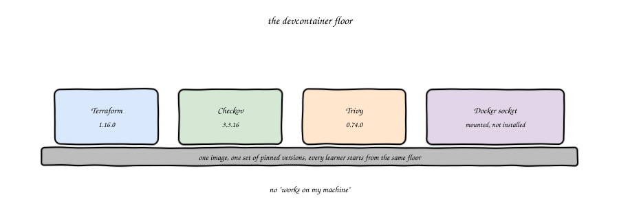
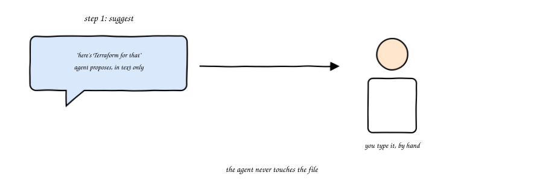
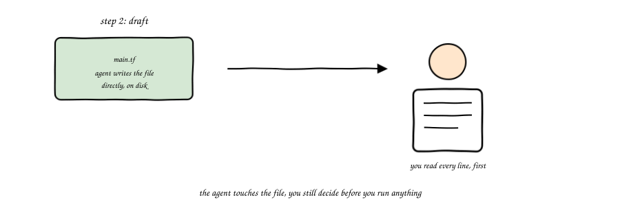
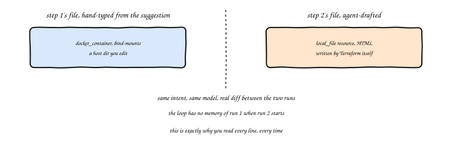
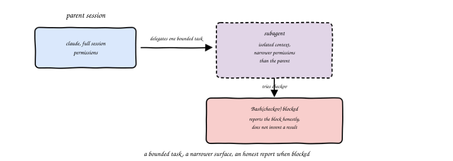
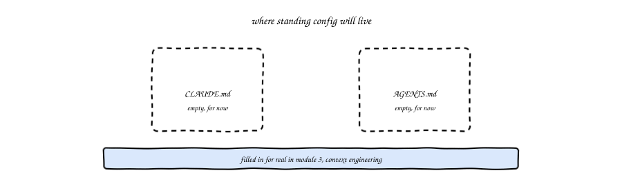

import Slides from '@site/src/components/Slides';
import Embed from '@site/src/components/Embed';

# Chapter 2: Your Agentic IaC Workstation

<Slides src="decks/m02-your-workstation.html" title="M2: Your Agentic IaC Workstation" />

## Recap: Theory Is Done, Now the Machine

Module 1 gave you the vocabulary: the seven eras, what an agent actually is, the
autonomy ladder, and the thesis that the agent proposes while the pipeline decides.
None of that needed a single install. This chapter is where that changes. By the
end of it, your own machine is an agentic IaC workstation, and this module's lab has
you build one real project on it, a local nginx test module, running the exact same
one-line intent from module 1's lab through a real agent five separate times, once
as a suggestion you typed yourself, once as a file the agent wrote directly, then
extended, audited, and finally wired into a one-word check of its own.

## A Workstation, Not One Tool

Would you call a carpenter's workstation just a hammer? No, it is a hammer, a saw,
a set of clamps, sitting on the same bench. This course teaches two agent CLIs side
by side, Claude Code and Codex, on purpose. Not because you need both every day.
Because a team that standardizes on one tool still needs to read code the other
tool produced, review a colleague's session, or switch when a vendor changes
pricing. Betting the whole course on one CLI would teach you that CLI's quirks
instead of the loop underneath it, and the loop is what actually transfers.

Both tools do the same job at their core: read an intent, act with tools, observe,
decide, repeat, stop. That loop is module 1's real definition of an agent, and it
does not change based on which CLI is running it.

## The Devcontainer Floor

Here is a question worth asking before you install anything: whose Terraform
version runs your lab, yours or the one this course was written against? If those
two answers can differ, you will spend more time debugging your environment than
the actual lesson. That is what a devcontainer fixes.

This course's devcontainer pins Terraform 1.16.0, Checkov 3.3.16, Trivy 0.74.0, and
mounts the Docker socket rather than installing Docker inside the container. Every
learner who opens it gets the same floor to stand on. "It works on my machine" is
not a debugging step here, it is a bug, because your machine and the course's
machine are, for the length of a lab, the same machine.

The Docker socket mount matters more than it looks. Module 1's troubleshooting
note about `aws_db_instance` hanging forever without it applies here too, any lab
that touches a real or emulated container depends on that one line in the
devcontainer config.

## Step 1: Suggest

The autonomy ladder from module 1 has six steps. This lab puts you on the first
two, felt directly rather than just read about.

Step 1 is suggest: the agent proposes text, you decide what lands in the repo.
You give the agent the same one-line intent from module 1's lab, the local nginx
container with a static page kept on disk, and instead of letting it touch any
file, you ask it to just tell you what it would write. You then move that answer
into your repo yourself, copy it, paste it, redirect it, whatever's fastest, the
same way you'd move a suggestion out of a chat window or a code review comment.

Nothing about this step is slower for the sake of being slower. It is the step
where you keep full control of what lands in your repo. The words came from the
agent, but nothing reaches disk without you deciding it should.

Day to day, this isn't a CLI flag you'd reach for either. You'd just ask, in an
ordinary interactive session, and not let the agent touch a file yet. The lab
uses a scripted, non-interactive form of the same thing, `--allowedTools ""`,
because a lab has to give the same result every time you run it, an interactive
back-and-forth can't be scripted that way. The next section is about that real,
day-to-day control surface.

### Two real dials: which tools, and how much permission

Claude Code gives you two separate controls over an agent session: which tools it
may call at all, and how much it can do with them before stopping to ask. Day to
day you set both interactively, Shift+Tab cycles the session's permission mode
right there in the prompt, and `/permissions` opens the actual allow/deny list.
Want a session where nothing stops to ask at all? That's
`claude --dangerously-skip-permissions`, reached for with your eyes open, the
CLI's own help text says plainly it's meant for sandboxes with no internet
access, not daily driving.

The lab's scripted steps use the non-interactive equivalents of both dials,
`--allowedTools` and `--permission-mode`, precisely so each step is
copy-pasteable and gives the same result every time. Six real permission-mode
values exist: `manual`/`auto` (the interactive default), `acceptEdits`, `plan`,
`dontAsk`, and `bypassPermissions`. `plan` mode is the real mechanism behind step
3 on the ladder, propose with plan, previewed in this module's lab and properly
taught starting M04.

### Try it: the permission mode simulator

Try the [Permission Mode Simulator](pathname:///310-agentic-iac-site/sims/permission-mode-sim.html):
pick which tools are allowed and a permission mode, then watch what actually
happens when the agent attempts a read, a write, a `terraform apply`, and an
arbitrary shell command. Every mode's behavior in the tool is checked against a
real `claude --help` run, not guessed.

<Embed src="sims/permission-mode-sim.html" title="Permission Mode Simulator" />

## Step 2: Draft

Step 2 is draft: the agent writes the file, you read every line before you do
anything with it. Same intent, same repo, but this time you let the agent create
`main.tf` directly. The difference from step 1 is not "more trust." It is a
different kind of control, from typing every character yourself to reading every
line before it runs.

Read that file the way module 1 asked you to read a `terraform plan`, all the way
through, not skimmed. A file you did not read is not "drafted," it is "trusted
blind," and step 2 on the ladder does not mean that.

## What Actually Differed

Here is something worth being honest about, because it is a real finding, not a
tidy one. Running the exact same one-line intent through the exact same agent
twice, once for a suggestion and once for a draft, did not produce two identical
files. In one real run captured for this chapter, step 1's suggestion used a
bind-mounted host directory for the static page. Step 2's draft, asked minutes
later with a slightly different framing, used a `local_file` resource with the
HTML written by Terraform itself instead.

Would you expect an agent to remember what it told you five minutes ago, in a
different session? It does not, unless something gives it that memory on purpose,
and nothing did here. Each run started cold, with only the intent you typed and
nothing else. That is not a bug in the agent. It is the reason step 2's "read
every line" instruction is not a formality. Two runs of the same ask can produce
two different, both individually reasonable, answers. The only way you catch that
is by actually reading what came back, every time.

Both runs also shared something less obvious: neither one wrapped its
`path.module`-derived file path in `abspath()`, and the docker provider rejects a
relative `host_path` the moment you actually plan a change, a check
`terraform validate` never performs. Two independent sessions made the identical
real mistake, caught only once someone ran `terraform plan`, not `validate`. That
gap, between a file that type-checks and a file that is actually safe to run,
is the whole reason this course keeps a real syntax-and-plan floor under every
lab, not just a syntax floor.

**Seeded failure:** a `docker_container` volume's `host_path` built from a relative,
`path.module`-derived reference. **Caught by:** `terraform plan`, not `terraform
validate`, the only step that actually evaluates the docker provider's absolute-path
requirement. **Fixed by:** wrapping the reference in `abspath()` at the point Docker
needs it.

## `acceptEdits`, Delegating to a Subagent, and a Slash Command

Step 2 asked you to approve one file write, once. `acceptEdits` mode keeps
approving for the rest of that session, no more per-edit prompts, while you still
watch every change happen in the transcript, turn by turn. It sits between step 2
and step 3's plan mode on the ladder: more autonomy than draft-and-read-once, less
than a plan you approve before anything moves.

In this module's own real run, `acceptEdits` extended the already-fixed step 2
module with a second static page and an nginx health-check location. The result
correctly carried the `abspath()` fix forward onto both new resources, imitating
the pattern already in the file rather than reintroducing the bug. That is a real
result from one run, not a guarantee about yours. `acceptEdits` removes the
per-edit prompt. It does not remove your job of reading what came back, the exact
same discipline step 2 already asked for, now covering more than one file change
at a time.

Not every check belongs inline. A **subagent** runs in its own isolated context,
useful for a bounded, well-defined task you want an answer to without spending
your main session's own context on it, and without handing it more reach than
that one task needs. In this module's real run, a subagent asked to audit a
module with `checkov` had its own `Bash` call blocked, its permission surface was
narrower than the parent session's, and rather than fabricate a result it said so
and told the parent to run the check itself. That is not a malfunction. A
subagent that inherited every one of its parent's permissions would not be
providing isolation at all, it would just be the same session with extra steps.
Module 6 turns this same idea, a narrower surface for a narrower job, into a
formal guardrail.

A **slash command** turns a sequence you keep re-typing into one word, checked
into the repo instead of remembered by a person. This module's lab builds a real
one, `.claude/commands/tf-check.md`, wrapping `fmt`, `init`, `validate`, and
`plan` behind `/tf-check`. It lives in the repo the same way `AGENTS.md` will
starting module 3, a fact the repo carries, not a habit one person has to
remember to run.

## Where Config Will Live

You will notice both CLIs look for a standing file at the root of your repo,
`CLAUDE.md` for Claude Code, `AGENTS.md` for Codex. Neither file has anything
written into it yet in this module. That is on purpose. Writing real content into
them, provider pins, naming conventions, the never-do list, is module 3's whole
subject, context engineering. For now, just know where they live, so you recognize
them the moment module 3 asks you to fill them in.

## Vocabulary

| Term | Meaning |
|---|---|
| Devcontainer | A pinned, shared development environment, so every learner starts from the same tool versions |
| Claude Code | An agent CLI taught in this course, one of two |
| Codex CLI | An agent CLI taught in this course, the other of the two |
| `CLAUDE.md` | Claude Code's standing-context file at a repo's root, empty until module 3 |
| `AGENTS.md` | Codex's standing-context file at a repo's root, empty until module 3 |
| Step 1, suggest | The agent proposes text, you type it into the file yourself |
| Step 2, draft | The agent writes the file directly, you read every line before doing anything else |
| `acceptEdits` | Every edit auto-approved for the rest of the session, still visible turn by turn |
| Subagent | An isolated, narrower-permission agent delegated one bounded task |
| Slash command | A repo-checked-in shortcut, `.claude/commands/name.md`, invoked as `/name` |
