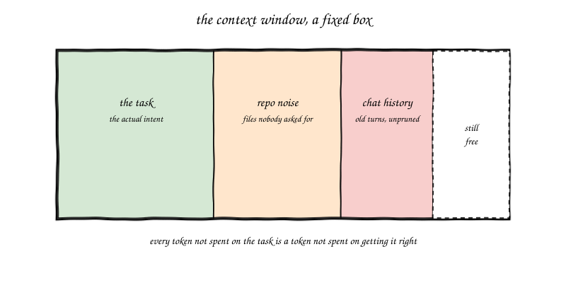
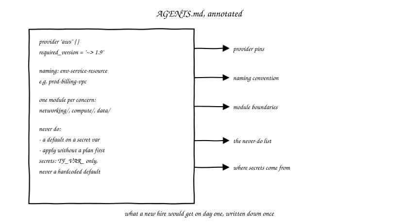
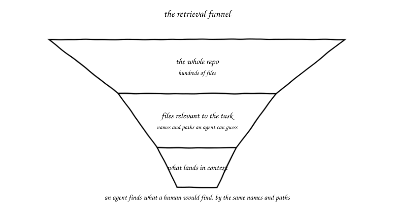
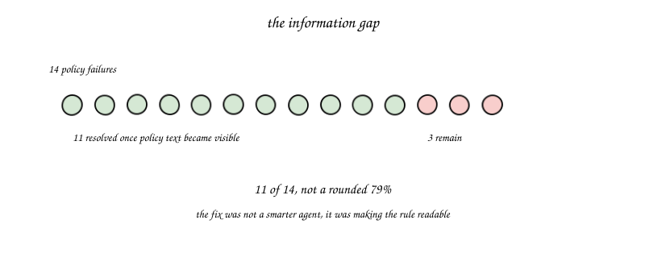
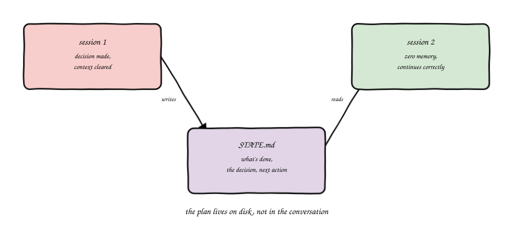
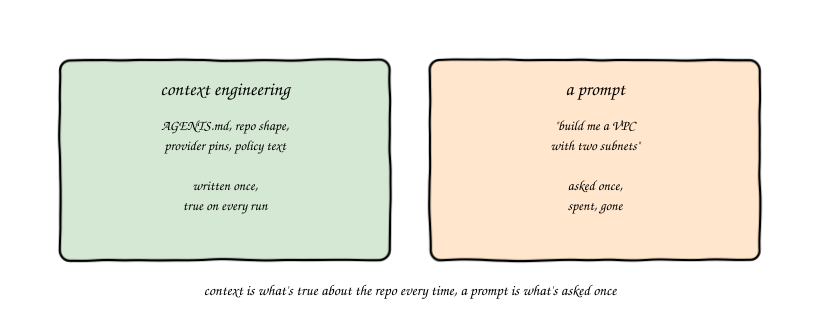
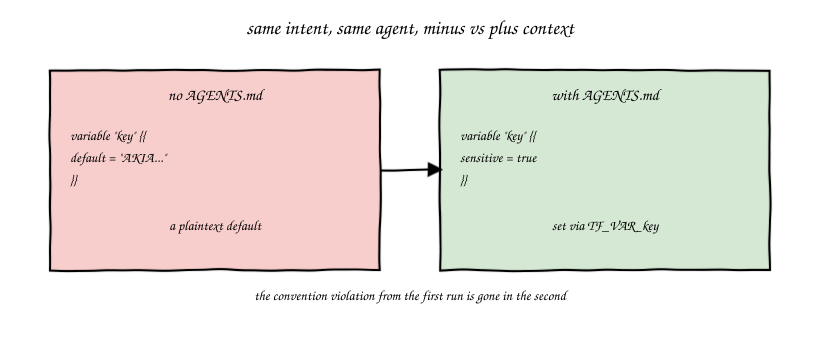

import Slides from '@site/src/components/Slides';
import Embed from '@site/src/components/Embed';

# Chapter 3: Context Engineering for Infrastructure

<Slides src="decks/m03-context-engineering.html" title="M3: Context Engineering for Infrastructure" />

## Recap: Where a Context Problem Lives

Module 1 gave you a small diagnostic: when an agentic workflow is not working, the
problem lives in one of three layers, context, harness, or loop. You would spot a
context problem by its symptom. It does not sound like "it keeps ignoring our
standards", that is a harness problem. It does not sound like "I have to babysit
every run", that is a loop problem. A context problem sounds like this: **"it can't
get one single task right, at all."**

That symptom means the agent never had what it needed to do the task correctly in
the first place. Not a bigger model. Not a cleverer prompt. Information.

Here is where this chapter has to get more honest than "write a good `AGENTS.md`
and you're done." That is one piece of context engineering, and by itself it is
thin. Real context engineering, the kind you will actually run into managing an
agent across a long session, a long project, a shift handoff, is about actively
managing a resource that keeps resetting on you. Three separate disciplines, not
one file.

## The Context Window Is a Scarce Resource

Every agent works inside a context window, a fixed budget of tokens it can hold in
its head at once. Would you call that budget generous? It is bigger than it used
to be, sure. But it is still a fixed box, and every run fills it with something.



Here is the part that is easy to miss. That box does not only hold the task. It
also holds whatever files the agent happened to read along the way, old turns of
chat history that never got pruned, and sometimes plain noise, a huge log file, an
unrelated README, a dependency lock file nobody meant to hand over. None of that is
free. Every token spent on noise is a token not spent on the task. A context window
that is half full of noise behaves like a smaller window than it actually is.

There is a second, harder fact underneath that one. This window is not just
scarce. It **resets**. Every new session starts blank. A long session eventually
gets compacted or cleared, and whatever wasn't written down anywhere else is gone,
the same way a whiteboard gets wiped at the end of a sprint. An agent that only
"knows" things because they happen to still be sitting in its current window is
one context clear away from forgetting all of it. If you have ever done an
on-call handoff to someone with zero memory of the last six hours of an incident,
you already understand the actual problem this chapter solves.

### Try it: the context window visualizer

Words only get you so far here. There's a small, interactive tool that makes this
concrete: [Context Window Visualizer](pathname:///310-agentic-iac-site/sims/context-window-sim.html).
Add pieces to a fixed 2,000-token window (an `AGENTS.md`, the file that actually
has the bug, the one-off ask, some noise) and watch whether the task would actually
land with what you gave it.

<Embed src="sims/context-window-sim.html" title="Context Window Visualizer" />

## Context Engineering Is Three Disciplines, Not One

Here is the whole chapter in one picture, and it is worth learning by name because
you will use these three words for the rest of this course:


**Reduce.** What you let *into* the window in the first place. Most of what fills
an agent's context is not the task, it's raw command output nobody asked for.

**Retain.** What survives a reset. Standing facts about your repo and your team
that should not have to be re-explained, re-discovered, or re-argued every single
session.

**Route.** Where an in-progress plan actually lives. Not in the conversation. On
disk, so a context clear, a crash, or a fresh session picking up someone else's
work in progress can all continue correctly without you re-briefing anything.

Miss any one of these and the other two don't save you. A perfectly filtered,
perfectly retained context is still useless if the actual plan for a three-hour
task lived only in a chat window that just got cleared. This chapter builds all
three, in order.

## Reduce: Filter Before It Enters

You already did this once, back in Lab 1, without a name for it. Recall
`checkov -d .`. Run it plain and it prints every passed check alongside every
failed one, with the offending source lines repeated under each finding. Run it
with `--compact` and it prints only what failed.

That is not a cosmetic flag. It is Reduce, in one command. Here is the real,
measured difference, run against this course's own 21-resource floci-spike
module, the same one M09 uses:

| | Plain `checkov -d .` | `checkov -d . --compact --quiet` |
|---|---|---|
| Output size | 25,605 characters | 3,881 characters |
| Rough token count | ~6,400 | ~970 |
| Reduction | baseline | **~85%** |

Same scan. Same findings. The only difference is whether every passed check and
every source-code excerpt got printed alongside the 25 things that actually
needed attention. If you hand an agent the plain version, every future turn in
that session is dragging 60 passed-check lines and a stack of repeated source
snippets it will never need again. Hand it the compact version, and the window
has room left for the part of the job that actually matters: fixing the 25
things that failed.

This is the general pattern of Reduce, not a one-off trick: raw tool output, a full
`terraform plan`, a verbose `kubectl describe`, an entire CI log, is not the same
thing as the information inside it that's relevant to the task. Filter at the
input, before it enters the window, not after. Prefer a tool's own quiet/compact
flag when one exists (`checkov --compact`, `terraform plan -compact-warnings`,
`kubectl get` instead of `-o yaml`) over piping the raw firehose straight into an
agent and hoping it skims past the noise.

There are dedicated tools built specifically to automate this, compressing noisy
command output before it ever reaches an agent, the same idea as `--compact`
applied generally instead of tool-by-tool. `rtk` is one real example. Before you
reach for one, hold the same skepticism this course applies to every other
vendor number: M12 covers a real, paired measurement of exactly this kind of
tool, and the honest result was smaller than the marketing page and, for one
tool, a measured *increase* in cost at low reasoning effort. Reduce is a real
discipline. A specific tool's claimed savings still needs a source, same as
everything else in this course.

## Retain: What Survives a Reset

So what actually goes in a file like `AGENTS.md`? Not a wish list. Not a style
guide for its own sake. The specific, load-bearing facts an agent would otherwise
have to guess, or get wrong, on the very first turn of a session that has no
memory of any earlier one.



**Provider pins.** Which version of Terraform or OpenTofu, which provider version,
pinned exactly. An agent that picks its own version picks whatever it last saw in
training data, which could be a year old or a year ahead of what your team runs.

**Naming convention.** `prod-billing-vpc`, not `vpc1` or `my-test-vpc`. Write the
pattern down once, and every resource an agent creates follows it, instead of you
correcting the name in every single review.

**Module boundaries.** One module per concern, `networking/`, `compute/`,
`data/`, whatever your team's actual structure is. An agent that does not know your
boundaries will happily put a database resource inside your networking module,
because nothing told it not to.

**The never-do list.** The short list of mistakes that are not subtle, a secret as
a `default` value, an `apply` run without reading the plan first, using a provider
version nobody approved. Write these down as flat rules, not as hints. An agent
follows a rule it can read far more reliably than one it has to infer.

None of this is exotic. It is exactly what you would tell a new engineer joining
your team this week, written down so you only have to say it once, and so it is
still there after this session ends and the next one starts blank.

### Repo Layout Is Retrieval

Here is a fact that surprises people the first time they hear it: an agent finds
files the same way a human does, by name, by path, by what looks relevant. There
is no hidden channel where it magically knows your intent. If a human engineer
would struggle to find the right file in your repo, an agent will struggle too.



Picture the funnel. At the top, your whole repository, maybe hundreds of files.
In the middle, the smaller set of files actually relevant to the task at hand,
found by name and by path. At the bottom, whatever finally lands inside the
context window and gets used. A repo with clear, predictable names narrows that
funnel fast. A repo where everything is called `main.tf` and `variables.tf`,
scattered across a dozen folders with no obvious pattern, forces the agent to
guess, the same way it would force a new hire to guess. Organize your repo for a
human reader first, and you have mostly organized it for an agent too.

### The Information Gap

Here is a real number worth sitting with. In a study of agents following written
policy, fourteen residual policy failures were on the table. Once the policy text
itself was made visible to the agent, not assumed, not implied, actually placed
where the agent could read it, **eleven of those fourteen** failures went away.



Read that number carefully: eleven of fourteen, not a rounded seventy-nine
percent. Small sample, real finding, worth stating exactly. And notice what the
fix was not. It was not a smarter model. It was not a longer, cleverer prompt. It
was making a rule that already existed, somewhere, in someone's head or in a
wiki page nobody reads, actually visible to the agent at the moment it needed it,
retained where the next session could find it, not re-explained by hand every
time. Most of what teams call "the agent doesn't follow our standards" is not a
harness problem or a model problem. It is an information gap. The rule was
real. It just was not written where the agent could see it.

## Route: Don't Trust What's Still in the Window

Reduce and Retain both assume the agent finishes the task in one sitting. Real
infrastructure work often doesn't. A task spans multiple sessions, gets
interrupted, or gets handed to a different agent, or a different engineer,
partway through. If the only record of "here's what's done and here's what's
next" lives in a conversation that's about to get cleared or compacted, that
record is one reset away from gone.



The fix is the same discipline a real on-call rotation already runs on: write
the handoff down. Not in your head, not only in the chat, on disk, as a file the
next session reads before it does anything else.

Here's a real one, run for this course, not a hypothetical. A small Terraform
module has one open finding, a hardcoded secret. The fix was already decided:
drop the `default`, mark the variable `sensitive`, document that it's set via
`TF_VAR_`. That decision, and the one instruction that follows from it, got
written to a plain file:

`file: STATE.md`
```
## Where this stands
main.tf has one open finding: var.api_key carries a hardcoded default. Checkov
has not been re-run since the finding was found.

## Decision already made, do not re-litigate
We are NOT deleting var.api_key. The fix is: drop the default, add
sensitive = true, set via TF_VAR_api_key at deploy time.

## Next action
Edit main.tf: remove the default, add sensitive = true. Run checkov -d . and
confirm exit 0.
```

Then, a genuinely fresh session, zero conversation history, nothing but this
file and one instruction, "read `STATE.md` and do exactly what it says":

`[ Expected output ]`
```
variable "api_key" {
  description = "Third-party API key for the log shipper sidecar. Set via TF_VAR_api_key at deploy time."
  type        = string
  sensitive   = true
}
```
```
checkov -d .
exit code: 0
```

Nobody re-explained the task. Nobody re-argued the decision that was already
made. The new session did not need to remember anything, because nothing it
needed was ever only in memory. That's Route: the plan is not a thing the agent
carries in its head between turns, it's a thing that lives on disk, that any
session, including one that has never seen this conversation before, can pick
up and continue correctly.

You'll run this exact exercise yourself in the lab, and you'll see the same
result: a state file survives a context clear that a conversation never would.

## Context Engineering, Not Prompt Engineering

You will hear the word "prompt engineering" a lot. This course does not use it,
and here is why. A prompt is what you ask once, for one task. Context is what you
Reduce, Retain, and Route on purpose, so it stays true and available across every
session that touches this work, not just the one you're in right now.



Say you ask an agent, "build me a VPC with two subnets." That is a prompt. It gets
spent the moment you send it, and it says nothing about how your team names things,
which provider version you pin, or where secrets are supposed to come from. Write
those facts down once, in a file the agent reads every time, and you never have to
retype them again. A good prompt gets you through one task. Good context, reduced,
retained, and routed on purpose, gets every future task, and every future session,
started from the same place a senior engineer on your team would start from.

## Before and After

Theory is easy to agree with and easy to skip. So here is the actual test: run the
exact same one-line intent, into the exact same agent, on the exact same repo,
once with no `AGENTS.md`, once with one written. What changes?



Without a written convention, an agent under time pressure reaches for the
fastest thing that works, a plaintext default on a secret variable, exactly the
mistake M01's lab caught with Checkov. With the convention written down, the same
agent, given the exact same intent, produces a `sensitive` variable, set from the
environment, the very first time, no scanner needed to catch it after the fact.
That is the whole payoff of Retain: the fix moved from "catch it after
generation" to "prevent it before generation ever happens." You will do this
exact comparison yourself in the lab.

**Seeded failure:** the same hardcoded `log_shipper_key` default from M01, run again
here with no `AGENTS.md` in the folder. **Caught by:** the same Checkov `CKV_SECRET_2`
finding, on run 1's output. **Fixed by:** not a one-off edit this time, writing the
never-put-a-secret-in-a-default rule into a standing `AGENTS.md`, so run 2 produces a
`sensitive` variable unprompted, on the first try.

## Vocabulary

| Term | Definition |
|---|---|
| Context window | The fixed budget of tokens an agent can hold in its working memory for a given run, and which resets between sessions |
| Context engineering | Deliberately managing what an agent knows across three disciplines: reduce, retain, route, so it does not have to guess and does not have to remember |
| Reduce | Filtering noisy raw tool output before it enters the context window, keeping the signal, not the firehose |
| Retain | Standing facts written once, in a file the agent reads every session, so they survive a context reset instead of needing re-explanation |
| Route | An in-progress plan or task state written to disk, not held only in conversation, so a fresh session can continue it correctly |
| Standing context | Information written down once, in a file the agent reads on every run, as opposed to a one-off prompt |
| `AGENTS.md` / `CLAUDE.md` | A written file of standing context for a repo: provider pins, naming conventions, module boundaries, a never-do list |
| Retrieval | The process by which an agent finds the files relevant to its task, mostly by name and path, the same way a human would |
| Policy visibility | Whether a rule a team actually enforces is written somewhere the agent can read it, or only lives in someone's head |
| Information gap | The distance between a rule that is real and a rule that is visible to the agent at the moment it needs it |
