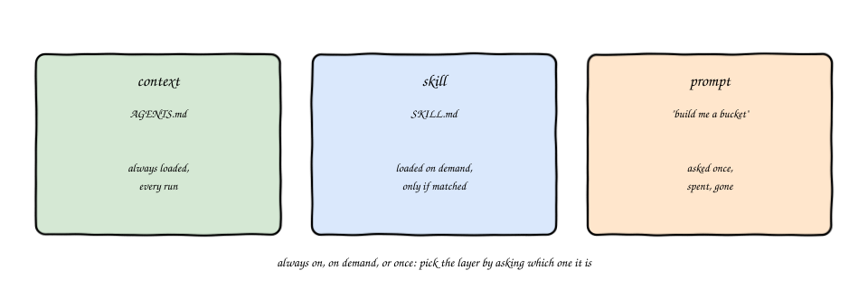
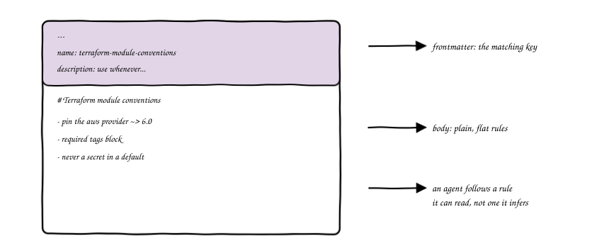
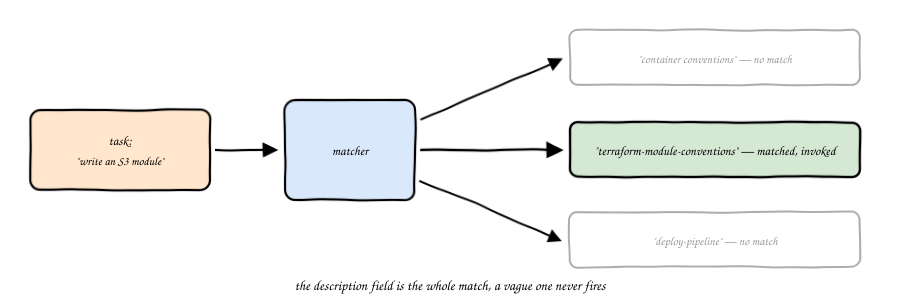
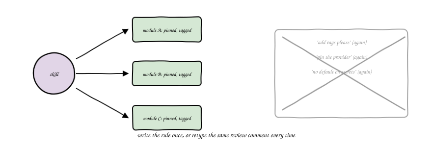
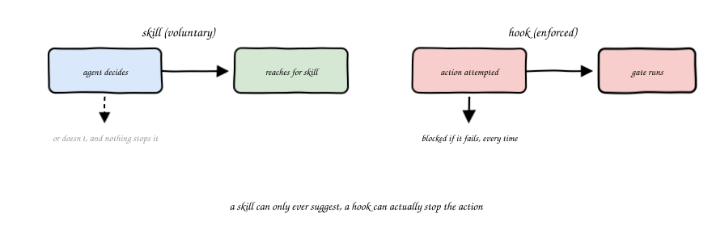
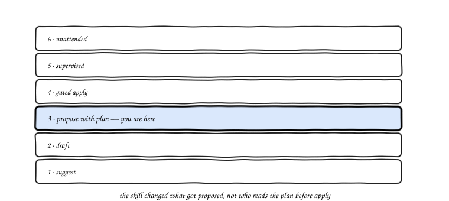

import Slides from '@site/src/components/Slides';

# Chapter 4: Agent Skills for IaC

<Slides src="decks/m04-agent-skills.html" title="M4: Agent Skills for IaC" />

## Recap: Context Is Loaded Every Time, a Skill Is Loaded on Demand

Module 3 gave an agent standing context, the facts that stay true about a repo on every
single run: provider pins, naming, the never-do list. That context loads whether or not
the current task needs all of it. A skill is different. It sits there, unused, until a
task actually matches what it's for, and only then does the agent pull it in.

Would you want every rule your team has ever written loaded into every single request?
No, that gets noisy fast, and noise is exactly what Module 3 warned you a context window
punishes. A skill solves a narrower problem: package a capability once, and let the agent
decide, task by task, whether this is the moment to reach for it.

## Context vs Skill vs Prompt

Three different things, and they get confused constantly because all three end up as text
an agent reads at some point.

A prompt is what you ask, once, for this task. It's gone the moment the task ends. Context,
from M03, is what's always true about the repo, loaded on every run whether or not this
particular task needs it. A skill sits in between: written once, like context, but loaded
only on demand, like a prompt is answered only once. The test for which one you're looking
at is simple. Ask: does this need to be true on every run, or only when this specific kind
of task comes up? The first answer points to context. The second points to a skill.

## Anatomy of a SKILL.md

Here's a real one, already living in this course's own repo.

`demos/m1-agent-preview/.claude/skills/container-conventions/SKILL.md` starts with a small
YAML block, `name` and `description`, then drops into plain prose instructions: pin every
base image, never run as root, always declare a health check. Nothing exotic. The whole
file reads like a short, specific section of a team wiki that somebody actually keeps up to
date, because in a working setup, that's exactly what it is.

## Discoverability Is the Whole Game

The frontmatter's `description` field isn't documentation. It's the matching key.

When an agent gets a task, it checks that task against every skill's `description` looking
for a match. Write a specific one, "use whenever asked to write, generate, or extend a
Terraform module for an AWS resource," and the skill fires exactly when it should. Write a
vague one, "Terraform best practices," and there's nothing concrete for the agent to match
against. The skill sits in the repo, correctly written, completely unused. A skill nobody's
agent ever triggers is worse than no skill at all, because it gives a team false confidence
that the rule is enforced somewhere.

## Skills Package House Convention

The real payoff isn't any single rule. It's not retyping the same review comment for the
tenth time.

Provider pins, a required tags block, no hardcoded secrets, write these once into a skill
and every module an agent generates afterward carries them, without a human retyping the
same three comments in every pull request. That's not a small thing on a team that
generates a lot of small modules. The review conversation moves from "you forgot the tags
again" to whatever the module is actually for.

## Skills vs Harness

A skill is voluntary. That word matters more than it looks like it should.

An agent can choose not to reach for a skill, misjudge that a task doesn't match, or simply
not have it loaded in a given session. A skill can only ever suggest the right behavior to
an agent that's already inclined to look for it. A hook or a gate is different: it runs
whether the agent wants it to or not, and it can flat out block an action the agent tried to
take. That's the harness, and it's a different guarantee entirely. This module doesn't build
that gate, M06 and M08 do. What matters here is knowing the difference before you assume a
skill is enforcing something it can only ever suggest.

## Where This Sits on the Ladder

The lab in this module has you read a written skill, use it once, and check the result
yourself before applying anything for real. That's step 3, propose with plan, from M01's
autonomy ladder, not step 5.

The skill changed what got proposed. It didn't change who's still reading the plan before
`apply` runs. Keep that distinction sharp: a better proposal is not the same thing as more
autonomy, and this module is squarely about the first one.

## Vocabulary

| Term | Definition |
|---|---|
| Agent Skill | A packaged, on-demand capability an agent loads when a task matches, not standing context and not a one-off prompt |
| `SKILL.md` | The file format for an Agent Skill: YAML frontmatter (`name`, `description`) plus body instructions |
| Frontmatter | The YAML block at the top of a `SKILL.md`, `name` and `description` |
| Discoverability | Whether an agent's task matches a skill's `description` closely enough to trigger it |
| House convention | Team-specific rules, naming, tagging, pins, packaged once into a skill instead of repeated in every review |
| Skill vs harness | A skill is invoked voluntarily by the agent; a harness gate runs and can block regardless of what the agent decides |
