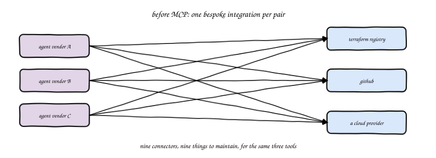
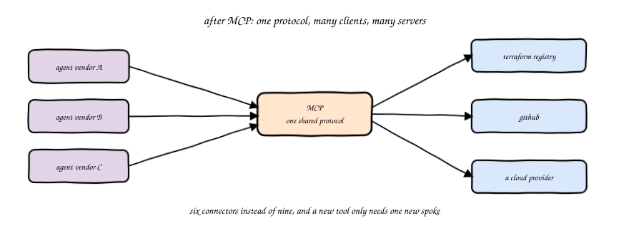
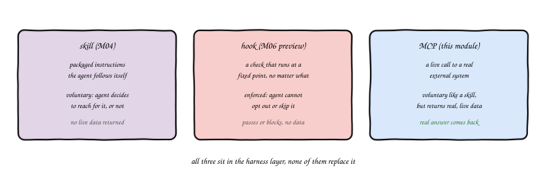
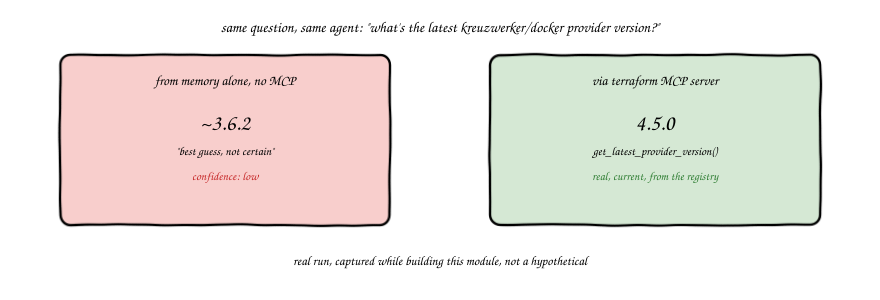
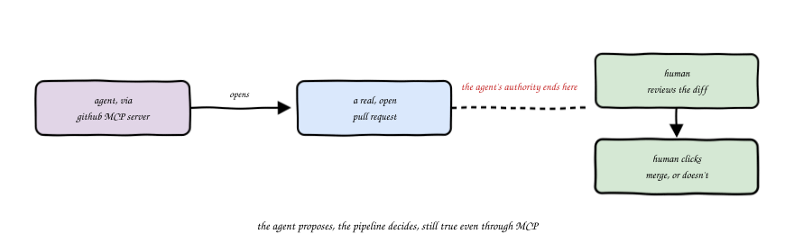
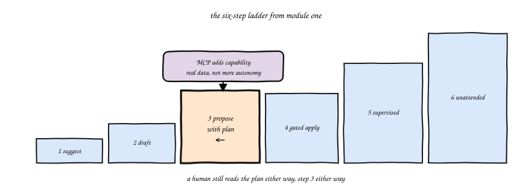

import Slides from '@site/src/components/Slides';
import Embed from '@site/src/components/Embed';

# Chapter 5: MCP and the Tool Layer

<Slides src="decks/m05-mcp-tool-layer.html" title="M5: MCP and the Tool Layer" />

## Recap: Skill, Hook, and Now MCP

Module 4 gave the agent a packaged capability, a skill: instructions it reaches for on its
own, when the task matches. Module 6 will give it something it cannot opt out of, a hook:
a check that runs at a fixed point, no matter what the agent wants. This chapter sits
between the two. It gives the agent a third kind of extension, a live connection to a real
system, so it can read real, current state instead of guessing.

All three, skill, hook, and MCP, live in the harness layer from module 1. None of them
replace the harness. Each one is one more piece of it.

## Before MCP: One-Off Integrations

Before MCP existed, every agent vendor wrote its own bespoke connector to every tool it
wanted to reach. One vendor's connector to the Terraform registry. A different connector
from a different vendor to the same registry. Multiply that by every tool and every
vendor, and you get a real maintenance problem: the same handful of tools, wired up again
and again, slightly differently each time.

## MCP: One Protocol, Many Clients

MCP, the Model Context Protocol, is nothing but a shared interface. One server exposes a
tool, or a resource, once. Any agent client that speaks the protocol can call it. The
tangle from the last section turns into spokes: one connection from each agent client to
the shared protocol, one connection from the protocol to each tool.

Would you call MCP a new idea? Not really. It's the same move as an ODBC driver or a
POSIX system call, one interface, many implementations behind it, many callers in front of
it. What's new is that agents are the caller.

## What an MCP Tool Call Actually Is

Here's the distinction worth being precise about, because "skill" and "MCP tool" get
confused constantly. A skill is packaged instructions the agent follows itself, using its
own reasoning and whatever it already knows. Nothing external gets called. An MCP tool
call is different: the agent asks a real, external server to do something, and a real
answer comes back. A skill can only ever suggest what the agent should do. An MCP tool
returns what's actually true, right now, on the other end of that connection.

## Stale Training Data Is a Real Failure Mode

A model's knowledge of a provider's current arguments comes from whatever it was trained
on, and training data has a cutoff. A provider that ships a new release next month is
invisible to a model trained before that release existed. Ask the model anyway, and it
won't usually refuse, it'll answer from memory, with whatever confidence it happens to
have.

Here's a real example, captured while this module was being built, not invented for the
page. The exact same question, asked of the exact same agent, twice:

> "What's the latest version of the kreuzwerker/docker Terraform provider?"

Asked from memory alone, with no MCP server available, the answer was **"~3.6.2, best
guess, not certain."** Asked again with the Terraform MCP server available, the agent
called `get_latest_provider_version` and got back the real number from the registry:
**4.5.0**. Not close. A learner trusting the first answer would have written a version
constraint against a release that's several minor versions behind current.

This is what an MCP tool buys you that a skill can't: not a better-worded suggestion, an
actual answer, sourced from the actual current state of a real system.

### Try it: stale vs live lookup

Toggle the Terraform MCP server on and off against the real captured question above, plus two
more in the same spirit: [Stale vs Live Lookup Simulator](pathname:///310-agentic-iac-site/sims/stale-vs-live-sim.html).

<Embed src="sims/stale-vs-live-sim.html" title="Stale vs Live Lookup Simulator" />

## Opening a Pull Request Is Not Merging It

The GitHub MCP server lets an agent do real things on a real repository: read files, open
branches, open a pull request. That last one is worth slowing down on, because "the agent
can open a PR" sounds, at first, like a step up in autonomy. It isn't.

Opening a pull request is a proposal. Nothing merges until a human reviews the diff and
clicks merge. The authority boundary from module 1, the agent proposes, the pipeline
decides, holds exactly as written here. The agent's reach through MCP still ends at
"here's a change, please look at it."

## Still Step 3

Put those two capabilities together, a live documentation lookup and the ability to open a
real pull request, and it can feel like the agent just got a lot more powerful. It did,
in one sense: it can now reach real systems instead of working only from what's in the
repo and what it remembers. But reach is not autonomy. A human still reads the plan before
anything real happens. This module's lab sits at the exact same place on the autonomy
ladder as module 4's: step 3, propose with plan. MCP adds capability. It does not add a
step.

## MCP Servers Are Still a Permission Surface

One more thing worth saying plainly before the lab: an MCP server is not automatically
safe just because it's official. What it can read and what it can write is configured,
same as the permission boundary module 6 teaches for hooks. A GitHub MCP server holding a
token with write access to every repository you own is a different risk than one scoped to
a single throwaway repository. Configure the narrowest scope that does the job, the same
instinct you'll formalize properly in module 6.

## Vocabulary

| Term | Meaning |
|---|---|
| MCP (Model Context Protocol) | A shared protocol that lets an agent call a tool or read a resource from an external server, without a bespoke integration per vendor |
| MCP server | The program exposing a tool or resource over MCP, for example the official Terraform MCP server |
| MCP client | The agent side of the connection, the thing that calls the server's tools |
| Tool call | An MCP request that asks a server to do something and return a real result |
| Resource | Data an MCP server exposes for an agent to read |
| Terraform MCP server | HashiCorp's official server (GA June 2026), never the deprecated `awslabs/terraform-mcp-server` |
| GitHub MCP server | The official MCP server for GitHub, used in this module to open a real pull request |
