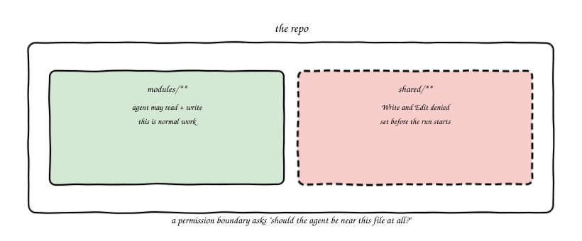
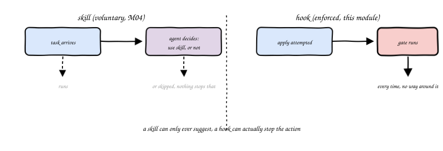
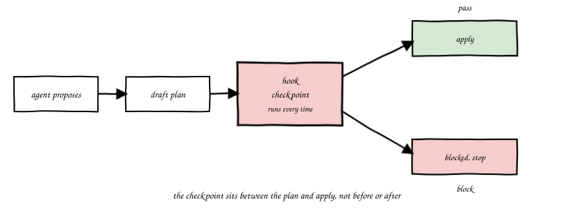
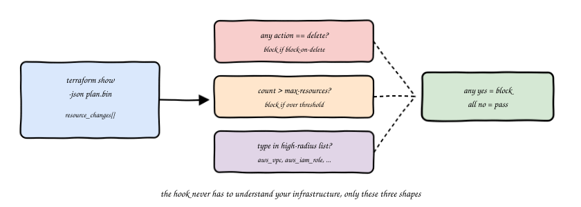
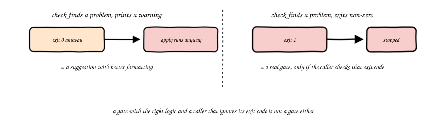
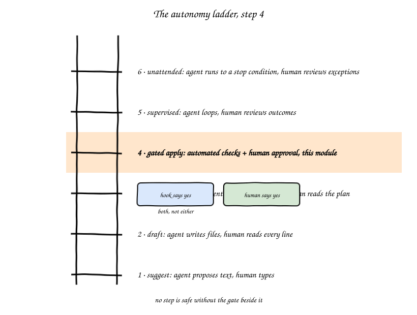

import Slides from '@site/src/components/Slides';

# Chapter 6: Guardrails: Permissions, Hooks, Blast Radius

<Slides src="decks/m06-guardrails.html" title="M6: Guardrails: Permissions, Hooks, Blast Radius" />

This module builds around one small, real project: a storage system an agent could delete by
mistake, protected three different ways, a mechanical gate, a structural boundary, and a
human-approval harness, so you can compare what each guardrail actually catches on the same real
delete. The lab builds it, this chapter explains why each piece works.

## Recap: A Skill Can Only Ever Suggest

Module 4 gave an agent a skill, a packaged bit of capability it reaches for on its own when a
task matches. That's real, and it's useful. But notice what it depends on: the agent has to
decide to use it. Would you call that a guarantee? It is not. A skill with a vague description
sits there, correct, unused. Even a good skill can be skipped, misread, or overridden by a louder
instruction in the same prompt.

This chapter is about the part that doesn't depend on the agent deciding anything: a hook. A hook
runs at a fixed point, every time, whether or not the agent wants it to.

## Permissions: What the Agent Is Even Allowed to Touch

Before a hook ever runs, there's a simpler question. What can the agent read, write, or execute in
the first place? That's a permission boundary, and it's set before the run starts, not negotiated
in the middle of one.

A permission boundary answers a narrower question than a hook does. A hook asks "is this specific
change safe?" A permission boundary asks "should this agent even be near this file?" You'd set
this kind of rule the same way you'd hand a new contractor a badge that opens some doors and not
others, before they've done anything wrong, just because some doors matter more.

## Hooks: Code That Runs Whether or Not the Agent Wants It To

Here's the definition this chapter actually turns on: a hook is code that runs at a fixed point in
an agent's workflow, before a tool call, before an `apply`, and it runs there every single time,
regardless of what the agent decided.

That word "regardless" is doing all the work in that sentence. An agent can ignore a skill. An
agent cannot skip a hook that's wired into the pipeline it runs through, the same way you can't
skip airport security by deciding you're in a hurry. Would that make a skill worthless? No, a
skill is still the right tool for "help the agent do the right thing by default." A hook is the
right tool for "make sure the wrong thing cannot happen even if something upstream got it wrong."

Where does a hook actually sit in the flow the agent runs through? Right between the plan and the
apply, checking the plan itself before anything touches real infrastructure.

## Blast Radius, Mechanically

Module 1 named blast radius as one of the four properties that make infrastructure riskier than
application code: a bug in a shared setting takes down everything connected to it. This chapter
turns that idea into something a script can actually check.

`terraform plan` has a JSON form. Run `terraform show -json` against a saved plan file and you get
a list of every resource change, each one tagged with its type and its action, create, update,
delete, or no-op. A hook doesn't need to understand your infrastructure. It only needs to read that
list and ask three narrow questions:

- Is a `delete` action present anywhere in this plan?
- Does the total number of resource changes exceed a threshold your team picked?
- Does this plan touch a resource type your team already agreed is dangerous by kind, an IAM
  role, a shared VPC, a policy, regardless of how small the diff looks?

### Try it: the blast radius gate visualizer

There's a small, interactive tool that runs these three checks live:
[Blast Radius Gate Visualizer](pathname:///310-agentic-iac-site/sims/blast-radius-sim.html). Pick a real plan kind,
a single delete, a bulk delete, a shared VPC change, tune the policy, and watch which check
actually trips. Try loosening `max-resources` until a bulk delete would pass on count alone, then
notice the delete check still catches it, because the checks are independent, not a single score.

None of those checks require the hook to know what your S3 bucket is for. That's the whole appeal.
A mechanical check catches a mechanical property. It won't catch "this bucket name is wrong for
our naming convention," that's still a skill's job, or a scanner's job, coming in M09.

## A Gate That Actually Gates

Would every check that runs before `apply` count as a hook, in the sense this chapter means? Not
quite. There's a real difference between a check that blocks and a check that only warns, and it
comes down to one thing: the exit code.

A script that finds a problem and prints a red message, then lets `apply` run anyway, is not a
gate. It's a suggestion with better formatting. A gate exits non-zero on failure, and the thing
that calls it, a wrapper script, a CI step, a pre-commit hook, has to actually stop when it sees
that non-zero exit. Both halves matter. A gate with the right logic but a caller that ignores its
exit code is not a gate either, it's theater.

## Two More Ways to Stop the Same Delete

The gate above catches a dangerous plan by reading it. That's one guardrail, not the only kind
a guardrail can take. This module's lab builds two more, on purpose, so the difference is concrete
rather than a taxonomy exercise.

**Structural: remove the ability, don't just check the plan.** A gate has to be right every time
it runs. A structural guardrail sidesteps that by never giving the agent `apply` access at all. An
agent proposes a change as a pull request. Automated checks and a human review run against the PR,
not the running infrastructure. A GitOps controller, reconciling against the merged state of the
repo, is the only thing that ever calls `apply` for real. "Can this agent apply?" stops being a
question a gate answers correctly on every attempt, because the agent was never wired to `apply`
in the first place. This module only previews the idea. M11 builds the real GitOps pipeline behind
it, PR, automated review, merge, reconcile, correctly and unattended.

**Procedural: an explicit human approval, sitting between two separate agent runs.** M02 already
showed the real mechanic: `claude --permission-mode plan` proposes a change and writes nothing. A
plan-review-approve-apply harness turns that single flag into four real steps: an agent proposes
in plan mode, the plan gets saved somewhere reviewable, a human runs an explicit approval command
that writes a marker file, and only then does a second, separate agent invocation apply the
approved plan, itself still passing through the mechanical gate from mechanism one. Skipping the
approval step doesn't quietly work, `apply_with_approval.sh` refuses outright with no marker file
present. This is what step 4, gated apply, looks like as a script you actually own, not a
description of what "gated apply" means in the abstract.

Notice what these three don't do: agree on one mechanism and call it done. A mechanical gate is
fast and consistent but only as good as the checks someone wrote into it. A structural guardrail
is strong but changes your whole delivery process, which is real cost, not free. A procedural harness
adds a human in the loop but depends on that human actually reading the plan, not just clicking
approve. Real infrastructure teams run more than one of these at once, for the same reason a
building has a lock on the door, a guard at the desk, and a badge system, none of the three alone.

## Step 4: Gated Apply

Module 1 introduced the autonomy ladder. Step 4 is "gated apply," automated checks plus human
approval, together, not either one on its own. This chapter's lab is where that step stops being
an abstract row in a table and becomes a script you wrote yourself.

Notice what step 4 is not. It is not "the hook approved it, so it's safe to skip the human." It is
not "a human looked at it, so the hook is redundant." Both have to say yes. The hook catches the
mechanical, blast-radius mistakes fast and consistently, every single time, something a
tired human reviewing their fortieth plan of the day will eventually miss. The human catches the
things no mechanical check can, whether this specific delete, at this specific moment, in this
specific bucket, is actually the right call.

## Vocabulary

| Term | Meaning |
|---|---|
| Permission boundary | What an agent can read, write, or execute in a repo, set before the run starts |
| Hook | Code that runs at a fixed point in an agent's workflow, every time, regardless of what the agent decided |
| Blast radius (mechanical) | A property read directly from a `terraform plan -json`: delete actions present, resource count, high-radius resource types touched |
| Gate | A check whose caller actually stops on a non-zero exit code, as opposed to one that only prints a warning |
| Step 4, gated apply | Automated checks and human approval together, neither one alone |
