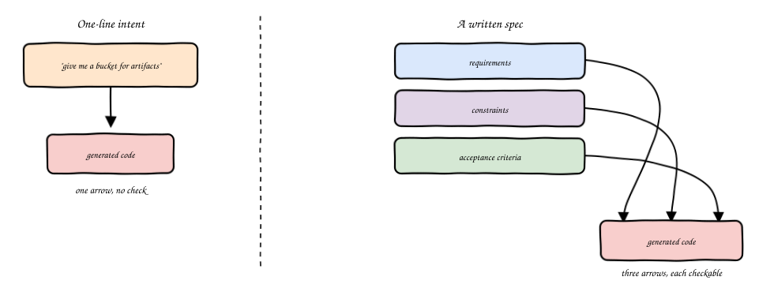
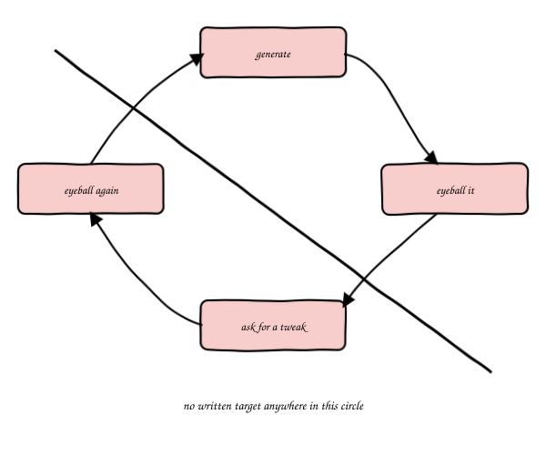
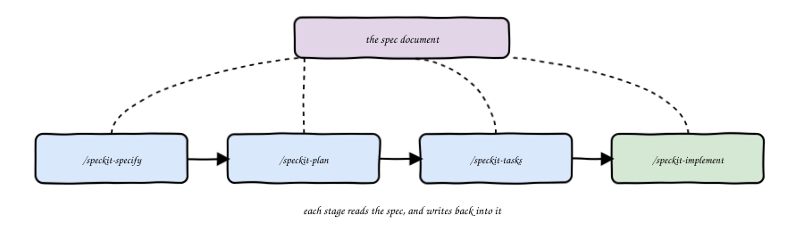
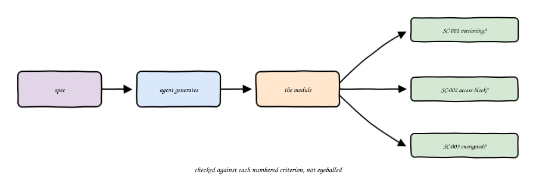
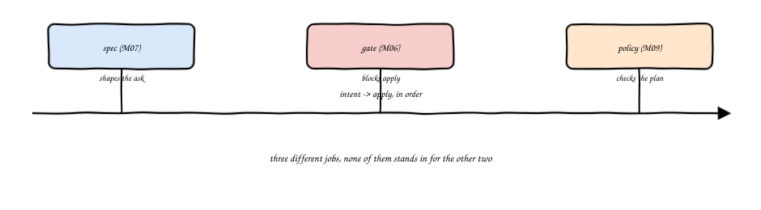
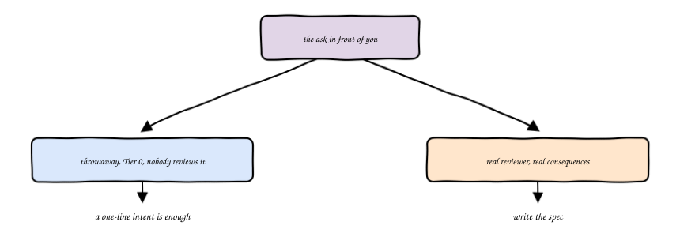

import Slides from '@site/src/components/Slides';

# Chapter 7: Spec-Driven Infrastructure

<Slides src="decks/m07-spec-driven-infra.html" title="M7: Spec-Driven Infrastructure" />

## Recap: A One-Line Intent Was Enough, Once

Module 1's lab handed you a single line: give me a local nginx container, serving a page you
control, nothing exposed outside the machine. That was fine. It was a first exercise, small
enough that one sentence carried the whole ask.

Real work rarely comes in one sentence. It comes as a ticket. Something like: give me an S3
bucket for storing build artifacts. Read that again. It says nothing about who can read the
bucket, whether an overwritten file is recoverable, or whether anything in it is encrypted. It
leaves almost everything for you to decide. That silence is normal. Most tickets look exactly
like this, and it is exactly where this chapter starts.

## What a Spec Has That an Intent Doesn't

A one-line intent has a goal and nothing else. A real spec has three separate parts, and each one
does a different job.

**Requirements** state what the thing must do. Versioned. Private. Tagged. Each one specific
enough that you could check it later without asking the person who wrote it what they meant.

**Constraints** state what the thing must never do. No public bucket policy, under any
circumstance. No hardcoded account ID inside a resource block. A requirement says what to build.
A constraint says what to refuse, even if it would be the easy path.

**Acceptance criteria** state, before anything is generated, exactly how you will check the
result. Not "does it look right." A specific, testable line: the versioning status equals
`Enabled`. You could hand that line to someone who never read the ticket, and they could still
check your work.

Write these three things down before you generate a single line of Terraform, and you have a
spec. Skip them, and you have a guess with good intentions.

## Vibe Coding, Named

There is a name for skipping all three: vibe coding. Generate something. Look at it. Ask for a
small tweak. Look again. Repeat, with no written target and no fixed criteria, until it feels
close enough.

This is named here once, because it already failed on infrastructure, in a specific and
checkable way, not because it's a technique worth weighing against spec-driven work. Here's what
actually goes wrong. Generate a bucket from "give me somewhere to store build artifacts," with no
requirements list in front of you, and you'll naturally stop at the first thing that satisfies
the sentence: a bucket resource, one line, done.
No versioning. No public access block. No encryption. It's not a strawman. It's what a fast,
reasonable-looking first pass produces when nothing was written down to check it against.

`terraform apply` doesn't know the difference between that and a careful, spec-driven module.
Both are valid HCL. Both apply cleanly. The gap only shows up later, when a scanner catches a
missing public-access-block on a bucket that's been live for months, or worse, when nobody
catches it at all. Application code that's "close enough" usually gets a chance to be fixed in
the next release. Infrastructure that's "close enough" is often already live, already holding
real data, before anyone reads it carefully. That's M01's asymmetry again: no undo, and failure
that stays quiet until someone goes looking.

## Spec Kit and Kiro Specs

You don't have to invent your own spec format. GitHub's Spec Kit gives you a real, structured
one. Install it, and it drops a set of skills into your coding agent: `/speckit-specify` writes
the baseline spec, `/speckit-plan` turns it into an implementation plan, `/speckit-tasks` breaks
that into actionable steps, and `/speckit-implement` generates against all of it. Kiro specs work
the same shape, a different tool, the same underlying idea: write the spec, then generate against
it, then check the result against what you wrote.

A Spec Kit spec has a fixed shape you'll recognize from the section above. Functional
requirements, written as `FR-001`, `FR-002`, numbered so you can point at exactly one. Success
criteria, numbered the same way, `SC-001`, `SC-002`, stated as something you could check with a
command, not something you'd have to eyeball. This isn't ceremony for its own sake. Numbered,
checkable lines are what let you verify a generated module against the spec instead of against
your memory of what you meant.

## Generate Against a Spec, Then Check It, Line by Line

Once the spec exists, generation is almost the boring part. Hand it to your agent, get a module
back, and check it against the spec's own criteria, one by one. Did versioning end up `Enabled`?
Check the state. Are all four public-access-block settings `true`? Check the state. Not "run it
and see if it looks fine." A line-by-line pass against lines you wrote down before you saw any
code.

Here's the honest part, and it matters as much as the success. A spec's acceptance criteria only
cover what its author thought to write down. Write a spec for a bucket with three requirements,
and a scanner will very likely still find things outside those three: no access logging
configured, no lifecycle rule, encryption set to a general algorithm instead of the specific one
your org standardizes on. None of that is a failure of spec-driven work. It's the spec doing
exactly what it promised, no more. A spec shapes what gets generated. It was never supposed to
replace what checks it afterward.

### Try it: spec-driven vs vibe-coded

Pick a path for the same S3 bucket ask and watch the real checkov numbers from this module's own
lab play out: [Spec-Driven vs Vibe-Coded Simulator](pathname:///310-agentic-iac-site/sims/spec-vs-vibe-sim.html).

## Spec vs Gate vs Policy: Three Different Jobs

It's tempting to think a good spec makes the later gates unnecessary. It doesn't, and this is
worth stating plainly so the three don't blur together.

A spec shapes the ask, before generation happens at all. It's nothing but a better question. A
gate, the kind you built in M06, blocks `apply` based on something mechanical: a blast radius, a
missing approval. A policy check, the kind M09 runs, scans the generated plan against rules
neither you nor the spec's author necessarily thought of. Three different jobs, three different
moments in the pipeline, and none of them stands in for the other two. `apply` still needs a
gate whether the module came from a careful spec or from ten seconds of guessing, because the
gate isn't checking how the module got written. It's checking what it's about to do.

## When It's Worth Writing One

A spec costs real time to write. That cost is worth paying whenever the answer to any of these is
yes. Will someone other than you review this? Will it hold real data or run in a real account?
Will you, six months from now, need to remember what "done" meant here? A one-line intent is
still fine for a throwaway exercise, a Tier 0 sandbox, something nobody but you will ever look
at again. The moment a real reviewer or a real consequence enters the picture, the ticket you got
handed deserves the three extra sections this chapter just walked through.

## Vocabulary

| Term | Plain definition |
|---|---|
| Spec-driven development | Writing requirements, constraints, and acceptance criteria before generating anything, instead of iterating on a result by feel |
| Requirement | A specific, checkable statement of what a thing must do |
| Constraint | A specific, checkable statement of what a thing must never do |
| Acceptance criteria | A stated, checkable line for how you will verify the result, written before generation, not after |
| Spec Kit | GitHub's structured spec-writing tool, installed as agent skills: specify, plan, tasks, implement |
| Kiro specs | A different tool for the same underlying idea, spec first, generate second |
| Vibe coding | Generating and iterating by feel, with no written spec and no fixed acceptance criteria. Named once in this course, as a failed approach on infrastructure specifically |
