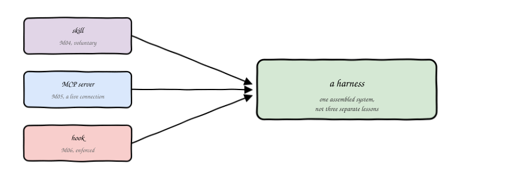
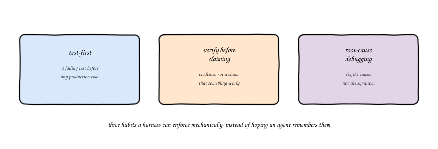
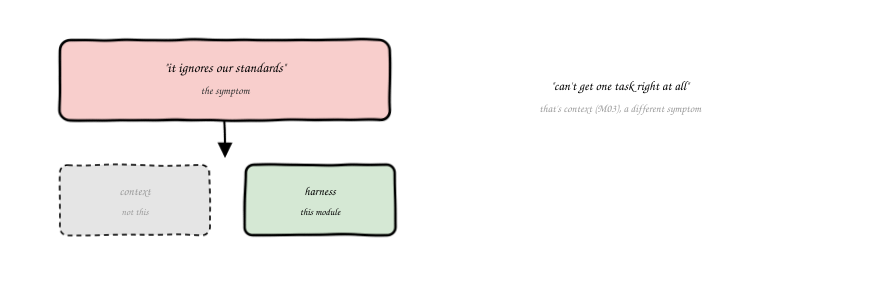
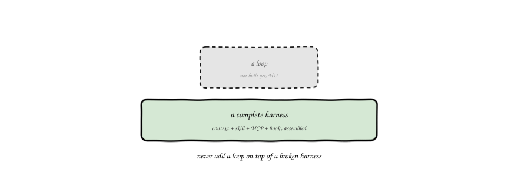

import Slides from '@site/src/components/Slides';
import Embed from '@site/src/components/Embed';

# Chapter 8: Harness Engineering

<Slides src="decks/m08-harness-engineering.html" title="M8: Harness Engineering" />

## Recap: Three Pieces, Taught Separately

Module 4 gave you a skill: packaged capability the agent reaches for when a task matches. Module 5
gave you MCP: a live connection to a real system, instead of a guess from training data. Module 6
gave you a hook: a check that runs whether or not the agent wants it to. Three separate lessons,
three separate lab exercises.

This chapter is where they stop being separate. A **harness** is what you get when a skill, an
MCP server, and a hook are assembled around one real discipline, not three unrelated tools sitting
next to each other in a repo.



## The Superpowers Pattern

The discipline this chapter assembles a harness around has a name in this course: the
**superpowers pattern**, three habits that a careful engineer follows under no pressure at all, and
skips the moment a deadline shows up. An agent skips them the same way, for the same reason, unless
something mechanical stops it.



**Test-first.** Write a failing test before any production code. Not because tests are virtuous in
the abstract, but because a test written after the fact tends to test what the code already does,
not what it's supposed to do.

**Verify before claiming.** Say something works only after you've actually run it and captured
real output, not because it looks right, not because it should work. Would you trust "looks fine"
from a colleague who never ran the thing? Then don't accept it from an agent either.

**Root-cause debugging.** Fix the cause, not the symptom. A patch that makes an error message go
away without explaining why it appeared is a patch that will reappear somewhere else.

None of these are new ideas. What's new is treating them as things a harness can check
mechanically, instead of habits you hope survive contact with a deadline.

## A Verification Hook, Annotated

Here's the piece of this chapter's lab you'll actually run. A small script, checked into the repo,
that reads a transcript and decides: does this completion claim have real evidence next to it?

```
CLAIM_RE='(checkov (passes|is clean|clean)|tests? pass(es)?|it works|this works)'
EVIDENCE_RE='(Passed checks: [0-9]+, Failed checks: [0-9]+|Check: CKV|exit code:? *0)'

if ! grep -Eiq "$CLAIM_RE" "$FILE"; then
  exit 0   # no claim made, nothing to check
fi
if grep -Eiq "$EVIDENCE_RE" "$FILE"; then
  exit 0   # claim made, evidence present, pass
fi
exit 1     # claim made, no evidence, block
```

Three branches, three outcomes: no claim, nothing to check. A claim with evidence, pass. A claim
with no evidence, block. Run this against two real transcripts and the behavior is exactly what
you'd expect: the same words, "checkov passes," get blocked once with nothing behind them, and
pass once with a real `Passed checks: 11, Failed checks: 5` line sitting right next to it. The
hook doesn't care whether the claim sounds confident. It cares whether the evidence is there.

### Try it: the verification hook simulator

Pick a claim, toggle real evidence on and off, and watch the same regex logic from
`verify_claim.sh` decide block or pass, live: [Verification Hook Simulator](pathname:///310-agentic-iac-site/sims/verification-hook-sim.html).

<Embed src="sims/verification-hook-sim.html" title="Verification Hook Simulator" />

## A Skill States the Rule, a Hook Enforces It

Notice these are two different jobs, and a harness needs both. `SKILL.md` states the rule in words
an agent reads: never claim a check passed without pasting the real output. That's useful, and it's
not enough on its own, because words are exactly what gets skipped under pressure. The hook is what
makes the rule true whether or not the agent read carefully: it scans the actual response, checks
for the pattern, exits non-zero if the evidence isn't there. A skill can only ever suggest. A hook
can actually stop the claim from standing.

## Harness vs Context, Revisited

Module 1 gave you a small diagnostic for when an agentic workflow isn't working: the problem lives
in context, harness, or loop, and each one has its own symptom. "Can't get one task right at all"
is context, covered in Module 3. **"Ignores our standards" is harness**, the agent understands
the task fine, it just isn't being held to the rule, and that's exactly what this chapter fixes.



If your team's rule is written down somewhere the agent reads but nothing ever checks whether the
agent actually followed it, you don't have a harness problem masquerading as a context problem.
You have a missing hook.

## What Has to Be True Before You Loop

The course's own house rule, stated in `CLAUDE.md` from day one, applies directly here: never add a
loop on top of a broken harness. Module 12 teaches looping, an agent running multiple iterations
with a human reviewing outcomes rather than every single step. That only works if the harness
underneath it actually catches mistakes. A loop on top of a broken harness doesn't fix anything,
it just repeats the same unbacked claims faster, with a human watching less closely each time.



This chapter doesn't teach a new step on the autonomy ladder. It builds the floor that step 5,
supervised autonomy, has to stand on before it's safe to attempt at all.

## Vocabulary

| Term | Meaning |
|---|---|
| Harness | A skill, an MCP server, and a hook assembled around one real discipline, not three separate tools |
| Superpowers pattern | Three disciplines: test-first, verify before claiming, root-cause debugging |
| Test-first | A failing test written before any production code |
| Verification-before-claiming | Real command evidence required before a "this works" claim is accepted |
| Root-cause debugging | Fixing the cause of a problem, not the symptom that revealed it |
| Assembled harness | The state where a skill states a rule and a hook enforces it, together, as one system |
