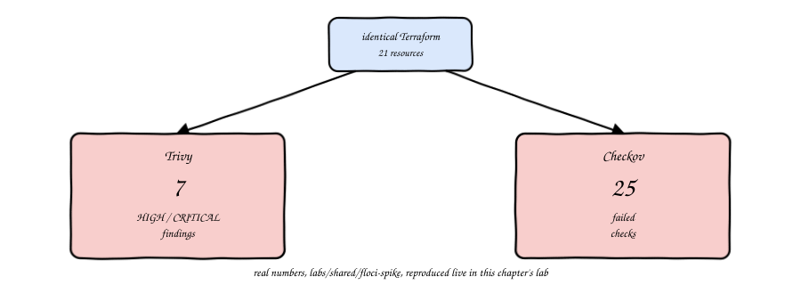
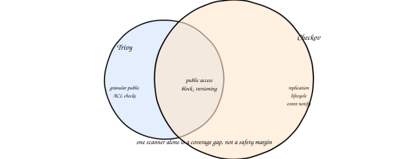
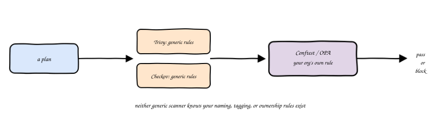
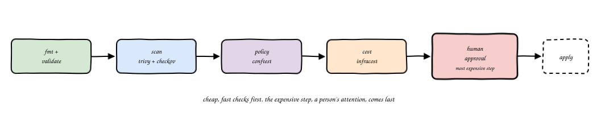
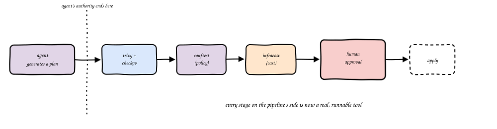
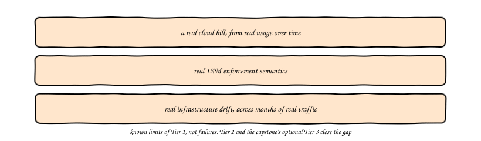

import Slides from '@site/src/components/Slides';
import Embed from '@site/src/components/Embed';

# Chapter 9: Verifying AI-Generated Infrastructure

<Slides src="decks/m09-verifying-ai-infra.html" title="M9: Verifying AI-Generated Infrastructure" />

## Recap: The Pipeline From M01

Since module one you have carried one sentence around: the agent proposes, the pipeline
decides. Module six built the first real piece of that pipeline, a hook that could block
an unsafe apply. This chapter builds the rest of it. By the end, "the pipeline decides"
stops being a slogan and becomes four real tools, run in a fixed order, on a real module.

## The Opening Demo: Same Code, Two Answers

Here is a fact worth sitting with. Take one Terraform module, twenty one resources, a
real three tier shape with a VPC, an EC2 instance, and an RDS database. Scan it with
Trivy. Then scan the exact same files with Checkov. You would expect roughly the same
answer, would you not? You do not get one.

Trivy reports **7 HIGH or CRITICAL findings**. Checkov reports **25 failed checks**. Same
code, same run, same day. This is not a bug in either tool. It is the real, reproducible
result of `labs/shared/floci-spike/run.sh` in this course's own repository, and this
chapter's own lab reproduces it again, live, on your machine, in under a minute.

## Why They Disagree

Neither number is wrong. Trivy and Checkov each ship their own rule set, and for
Terraform's AWS resources, the two rule sets only partly overlap. Checkov's is the
strictly larger one here: it checks things like cross region replication, event
notifications, and lifecycle configuration that Trivy's rule set does not encode at all
for this resource type. Trivy, in turn, sometimes splits one Checkov check into several
more granular ones, for example separate findings for blocking public ACLs, blocking
public policies, and ignoring public ACLs, where Checkov collapses that into one public
access block check.

That is the whole lesson in one sentence: **running one scanner is a coverage gap, not a
safety margin.** You would not ship with only one of the four asymmetries from module one
checked. Do not ship with only one scanner either.

## What Neither One Catches

Even running both tools together, there is a category of rule neither one will ever
check, because neither one knows your team exists. Say your organization requires every
`aws_s3_bucket` to carry an `Owner` tag, so someone is on the hook when it shows up on a
bill. Trivy does not know that rule. Checkov does not either. It is not a security rule
in the generic sense, it is *your* rule.

This is what **OPA**, the Open Policy Agent, and its command line front end **Conftest**,
are for. You write the rule once, in a small policy language called Rego, and Conftest
checks every plan against it, the same way Trivy and Checkov check plans against their
own built in rules.

This chapter's lab has you write exactly this policy, watch it fail on a real,
unfixed module, fix the module, and watch it pass.

## Cost as a Gate, Not a Report

Most teams that use **Infracost** use it the way you would use a smoke detector that
never rings, they read the estimate once, and move on. That is a report, not a gate. A
gate is a check that can actually stop a plan, the same way Checkov's exit code stops
`apply` when it fails.

Set a real threshold, an instance type ceiling, a monthly dollar figure, whatever your
team actually cares about, and fail the pipeline when a plan crosses it, exactly the way
a scanner failure would. The plan that quietly adds three `db.r5.4xlarge` instances
should stop at the same gate as the plan with an open security group, not sail through
because nobody reads cost reports carefully on a Friday.

Infracost's own CLI needs a one-time, free account to fetch live pricing, no credit card,
just a signup and a device login. If you have not set that up yet, this chapter's
pipeline script detects that and skips the cost stage cleanly, with an honest message
instead of a guessed number. Set up your own key before the lab if you want to see this
stage run for real.

## Order Matters

Put the cheapest, fastest checks first. `terraform fmt` and `validate` take under a
second and catch a typo before you spend a scanner's runtime on it. Scans come next,
they are seconds to tens of seconds. Policy checks after that. Cost estimation, which
sometimes calls out to a pricing API, comes after the checks that can fail for free.
Human approval, the most expensive step of all because it spends a person's attention,
comes last, only once everything upstream has already said yes.

Get this order backwards, run the expensive check first, and you waste a person's
attention on a plan that a one second `fmt` check would have caught.

## The Assembled Pipeline

Put it together and you get the concrete version of module one's authority boundary
diagram, every stage now a real, runnable tool instead of a label:

**scan (Trivy, Checkov) → policy (Conftest) → cost (Infracost) → human approval → apply**

The agent's job ends at generating a plan. Everything after that line is the pipeline's
job, and now you have built every piece of it, from the hook in module six through the
four tools in this chapter.

### Try it: the pipeline gate walkthrough

There is a small, interactive tool that makes this concrete:
[Pipeline Gate Walkthrough](pathname:///310-agentic-iac-site/sims/pipeline-gate-sim.html). Toggle any stage to
fail, run the pipeline, and watch it stop exactly there, with every stage before it still
counted as passed and everything after it never reached at all, including human approval.
Toggle everything back off and run it again to see a clean pass reach `apply`.

<Embed src="sims/pipeline-gate-sim.html" title="Pipeline Gate Walkthrough" />

## What Tier 1 Still Cannot Show You

Be honest about the limits of what you just built. Floci gives you a real, API shaped
emulation, good enough to run real scanners against real plans and get real answers. It
cannot show you a real cloud bill, real IAM enforcement, or infrastructure that drifts
over months of real traffic. Those stay out of reach until module ten's Tier 2 labs and
the capstone's optional Tier 3.

## Vocabulary

| Term | Meaning |
|---|---|
| Trivy | A misconfiguration and vulnerability scanner, one of two scanners this course always runs together |
| Checkov | The second scanner this course always runs, with a broader Terraform rule set than Trivy for most AWS resources |
| OPA | Open Policy Agent, a general purpose policy engine for rules generic scanners do not encode |
| Conftest | The command line tool that runs OPA policies against structured input like a Terraform plan |
| Rego | The policy language OPA and Conftest policies are written in |
| Cost gate | A cost check wired to actually fail the pipeline past a real threshold, not just print a number |
| Plan-diff review | The human step where a person reads what a plan would actually change, after every automated gate has already passed |
