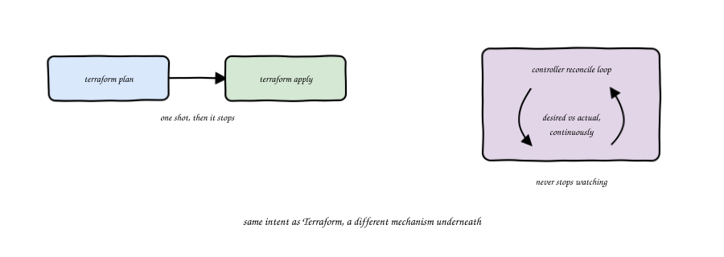
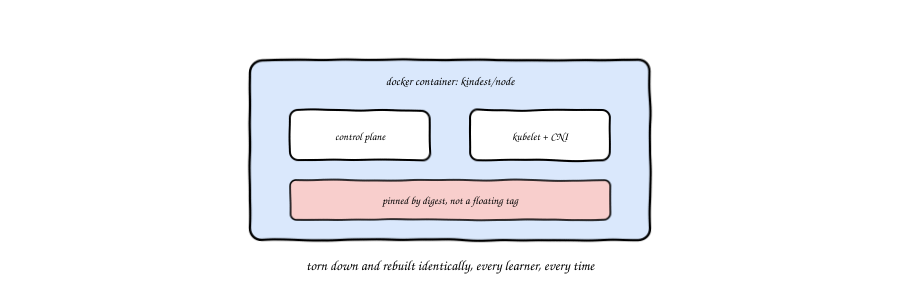
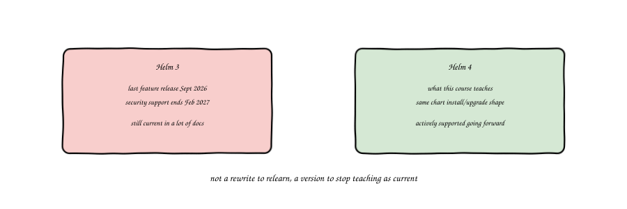
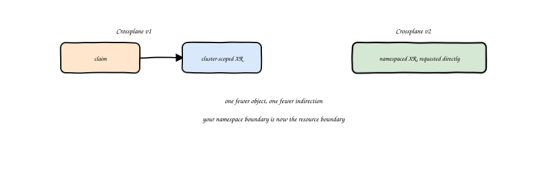
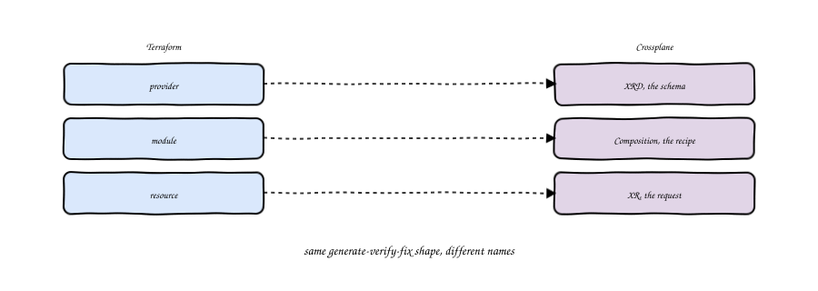
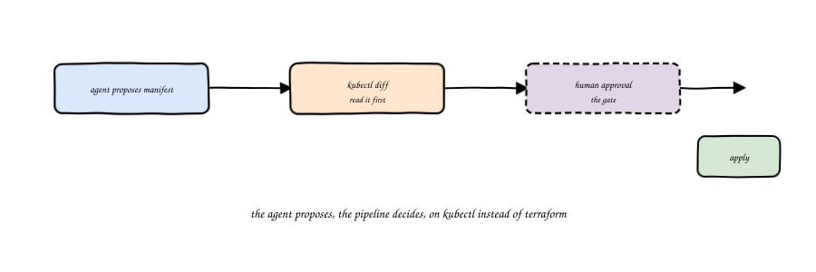

import Slides from '@site/src/components/Slides';
import Embed from '@site/src/components/Embed';

# Chapter 10: Agentic Kubernetes and Platform IaC

<Slides src="decks/m10-agentic-kubernetes.html" title="M10: Agentic Kubernetes and Platform IaC" />

This chapter's lab builds one real project: a way for a team to get a Postgres database on
demand, on a real Kubernetes cluster, no ticket to a platform team required. You build it
three times, each a step up in how self-service it is: raw manifests you can read end to
end, a Helm chart anyone can install without touching YAML, and a Crossplane custom resource
that turns the whole thing into a five-line request. The rest of this chapter is what you
need to understand before that build makes sense.

## From Plan and Apply to Reconcile

Every module before this one ran against Terraform. Local providers in the early modules,
Floci-emulated cloud providers from module four onward. The discipline stayed the same the
whole way: read the intent, generate against it, check the plan, scan it, gate it, apply
it.

This module keeps that discipline and changes what it runs against. `terraform apply` is a
one-shot action. You run it, it does its work, and it stops. Kubernetes does not work that
way. A Kubernetes controller reads what you want, compares it against what is actually
running, and keeps doing that forever, in a loop, whether or not anyone is watching. That
loop is called reconciliation, and it is the real mechanical difference this chapter is
about.

Would a one-shot apply and a continuous reconcile loop ever disagree on the same intent?
Not on what you asked for. They disagree on what happens after. Delete something a
Terraform-managed resource owns, and it stays deleted until someone runs `apply` again.
Delete something a Kubernetes controller owns, and it often comes right back, because the
controller is still watching.

### Try it: the reconcile loop visualizer

Words describe a loop, they don't let you feel one running. There's a small, interactive
tool that does: [Reconcile Loop Visualizer](pathname:///310-agentic-iac-site/sims/reconcile-loop-sim.html). Drift
the live state away from what's desired, the same way the lab's own drift step does, and
watch the controller correct it back over a few ticks, unattended, without anyone running a
command.

<Embed src="sims/reconcile-loop-sim.html" title="Reconcile Loop Visualizer" />

## A Real Cluster, Not an Emulated One

Tier 1 in this course ran against Floci, an emulator built to the AWS API. That was the right
choice there: Terraform's providers speak to a cloud API, and emulating the API is enough
to teach the discipline safely, for free, on a laptop.

Kubernetes does not need that emulation. `kind` runs a real Kubernetes cluster inside a
single Docker container. Not a look-alike, not a subset, a real control plane, a real
kubelet, a real API server, the same binaries a production cluster runs.

That container's image matters more than it looks like it should. A `kind` config that
says `kindest/node:v1.31.0` is naming a moving target. New builds of that tag land over
time, and a cluster you build today can quietly differ from the one you build in six
months. Pin the image by digest instead, the exact content hash, not the name someone
might repoint later. Every learner who runs this module's lab gets the identical cluster,
every single time.

## Helm 4

You will use Helm in this module to install Crossplane. Helm 3 has been the default for
years, and a lot of documentation still shows it as current. It is not, not for much
longer. Helm 3's last feature release landed in September 2026, and its security support
ends in February 2027. This course teaches Helm 4 from here on.

Nothing about the chart-install workflow got harder. `helm install`, `helm upgrade`, `helm
list`, all still work the way you would expect. The point of this section is smaller than
it sounds: stop treating Helm 3 commands you find online as automatically current, and know
which version you are actually running.

## Crossplane v2: Claims Removed

Crossplane turns a Kubernetes custom resource into real, composed infrastructure. Version 1
did this with two objects working together: a cluster-scoped composite resource (an XR) and
a namespaced claim that stood in for it, so an application team could request infrastructure
without needing cluster-wide permissions.

Version 2 removed the claim. The composite resource itself is namespaced now, so a team
requests it directly, in their own namespace, with no separate claim object standing in the
way.

That is one fewer object to reason about, and one fewer indirection between what a team
asks for and what actually exists. A namespace boundary was already how Kubernetes
separates teams. Crossplane v2 just stopped duplicating that boundary with a second object.

## XRD, Composition, XR

Three pieces make up the platform layer, and they map cleanly onto what you already know
from Terraform.

A `CompositeResourceDefinition` (an XRD) is the schema, what fields a request can carry,
the same job a Terraform provider's resource schema does. A `Composition` is the recipe,
what actually gets created when someone asks, playing the same role a Terraform module
plays. The XR itself, the object a team applies, is the request, the same role a Terraform
resource block plays. Different names, the same three layers: define the contract,
write the recipe, request the thing.

## The Same Authority Boundary, a New Substrate

Nothing about the course's thesis changes here. The agent proposes, the pipeline decides,
whether the object being proposed is a Terraform resource or a Kubernetes manifest.

`kubectl diff` plays the same role `terraform plan` played in every earlier module: read it
before anything lands. A human approval gate sits in the same spot it always has. Only the
verb at the very end changes, `kubectl apply` instead of `terraform apply`.

## One Capability, Three Ways to Deliver It

Everything above explains the mechanics. The lab's real build is a single capability, a
Postgres database, delivered three ways, each one a step up in how self-service it is for the
team asking for it. No Backstage, no catalog product sitting on top, this is what a platform
team actually operates at the Kubernetes layer: a chart, plain manifests, and a Kubernetes-native
custom resource.

Raw manifests are the ground truth. A `Secret`, a headless `Service`, a `StatefulSet` with a
`volumeClaimTemplate`, written by hand, every field explicit. Nothing about the layers above
this one is doing anything you couldn't do yourself, they're doing it with less typing.

A Helm chart packages exactly those manifests, swapping hardcoded values for
`{{ .Values.* }}` references. `helm install --set dbName=billing_service` installs a
completely independent instance without anyone reading or editing YAML. This is real
packaging, not a teaching simplification, `helm list` shows a real release, `helm uninstall`
removes exactly what was installed.

A Crossplane XR turns the same three manifests into a Composition, and the request itself
shrinks to five lines: a `dbName` and a `storageSize`. The team requesting it never sees a
`StatefulSet`, only the XRD's schema. This is the version an agent can safely propose on a
team's behalf, the schema is small enough to read in full before generating anything against
it.

### Composing a Built-In Kind Is Not Like Composing a Provider

The database Composition patches a generated name onto a `Secret`, a `Service`, and a
`StatefulSet` using a string transform, and every version of `function-patch-and-transform`
this course pins requires that transform to carry an explicit `string.type: Format` field.
Drop it, and the function itself refuses the whole pipeline before touching a single
Kubernetes object, `invalid Function input: resources[0].patches[1].transforms[0].string.type:
Required value`.

**Seeded failure:** the `db-secret` resource's `metadata.name` to `metadata.name` transform,
the one that generates the Secret's own object name (`%s-postgres-creds`), omits its required
`string.type: Format` field. **Caught by:** the composition function rejecting the
pipeline input outright, an error `lab/run.sh` regression-tests for real by applying a scratch
copy of the Composition with that field stripped and confirming the exact `string.type:
Required value` message reappears. **Fixed by:** putting `type: Format` back on the transform's
`string` block.

Crossplane's earliest, most common use composes resources through a provider, `provider-aws`
or similar, authenticating to a cloud API with its own credentials. Composing a native
Kubernetes kind directly, a `Secret`, a `Service`, a `StatefulSet`, has no separate credential
to lean on. Crossplane acts as itself, through its own `ServiceAccount`, and needs its own RBAC
grant for exactly what it composes. The default `crossplane` `ClusterRole` grants
`get/list/create` on `apps/deployments` and nothing on `apps/statefulsets`. Compose a
`StatefulSet` without adding that grant, and the failure reads like a caching bug, `Timeout:
failed waiting for *unstructured.Unstructured Informer to sync`, when the real cause is a
permission Crossplane never had.

**Seeded failure:** the `crossplane` `ServiceAccount` carries no RBAC grant on
`apps/statefulsets`. **Caught by:** the XR's own status still shows the misleading Informer
timeout, `kubectl get events` is where the real forbidden error actually surfaces the moment
Crossplane tries to create the composed `StatefulSet`, and that gap between the two is the
lesson, confirmed as a `lab/run.sh` regression check that applies the Composition before
`db-composer-rbac.yaml` and asserts that exact event fires. **Fixed by:**
`lab/solution/db-composer-rbac.yaml`, a `ClusterRole` and `ClusterRoleBinding` granting the
`crossplane` `ServiceAccount` full CRUD on `apps/statefulsets`.

Readiness has the same trap for a different reason. A `Deployment` and most provider-managed
resources carry `status.conditions`, so `MatchCondition` reads them cleanly. A `StatefulSet`
carries `status.readyReplicas` instead, no `Ready` condition at all. `MatchInteger` against
that field looks like the right fix and hits a real number-parsing bug in this function
version. The actual fix is the same one the module's own `ConfigMap` warm-up already used,
`readinessChecks: [{type: None}]`, then check real readiness with `kubectl` the way you would
for any workload. Same workaround, two different real reasons to reach for it.

**Seeded failure:** the `db-statefulset` readiness check reads `status.readyReplicas` with
`MatchInteger`. **Caught by:** the composed resource's readiness check erroring outright,
`cannot run readiness check at index 0: status.readyReplicas: not a (int64) number`, an error
`lab/run.sh` regression-tests for real against a scratch copy of the Composition carrying that
`MatchInteger` check. **Fixed by:** `readinessChecks: [{type: None}]`, verifying real readiness
with `kubectl` instead of a status field Crossplane can watch.

## Vocabulary

| Term | Meaning |
|---|---|
| Reconcile loop | A Kubernetes controller continuously comparing desired state against actual state, and correcting drift, instead of running once and stopping |
| `kind` | A tool that runs a real Kubernetes cluster inside Docker, used here for a free, local, real Tier 2 lab |
| Node image digest | The exact content hash of a `kind` node image, pinned instead of a floating version tag, so every learner gets an identical cluster |
| Helm 4 | The chart-install tool this course teaches from here on, Helm 3's security support ends February 2027 |
| Crossplane v2 | The version of Crossplane used in this module, where claims were removed in favor of namespaced composite resources |
| XRD | `CompositeResourceDefinition`, the schema for a platform request, Terraform's provider-resource-schema equivalent |
| Composition | The recipe a Crossplane XRD generates against, Terraform's module equivalent |
| XR | The composite resource a team actually requests, Terraform's resource-block equivalent |
| Database-as-a-service | A capability, not a product, requesting a real database without hand-writing its manifests, delivered here via raw manifests, a Helm chart, and a Crossplane XR |
| Composed-resource RBAC | The explicit `ClusterRole` grant Crossplane's own `ServiceAccount` needs to compose a native Kubernetes kind it doesn't already have permission for |
