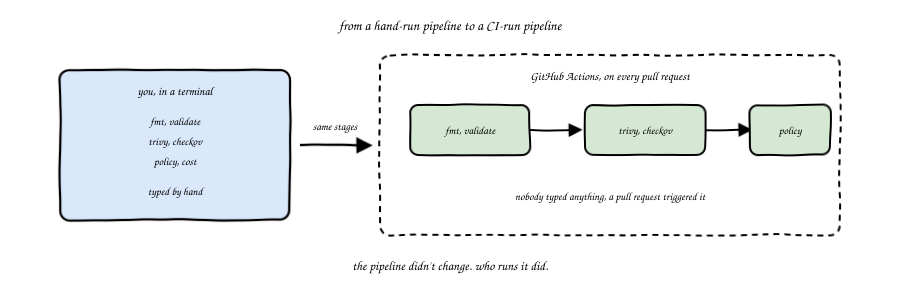
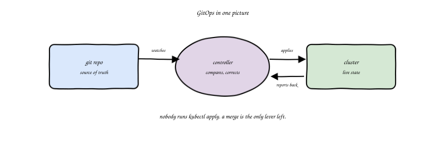
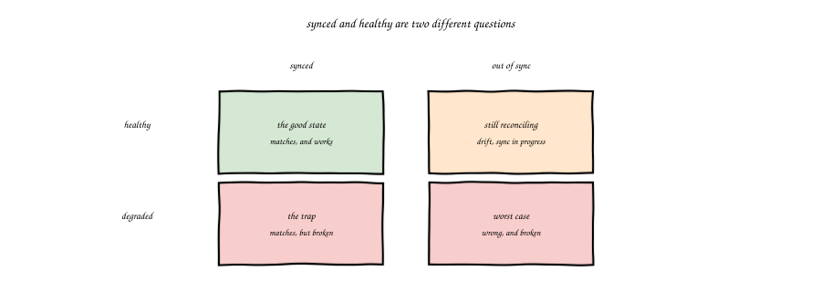
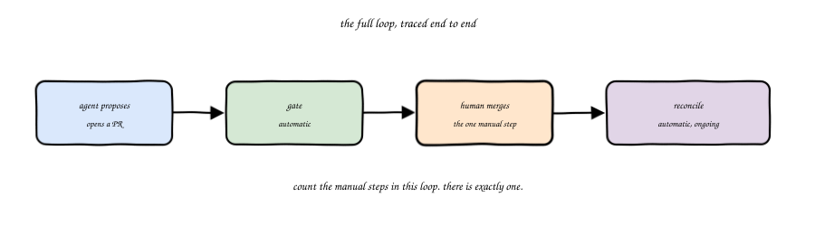
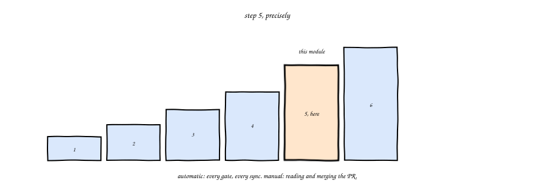
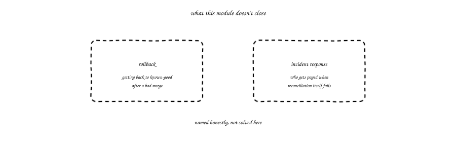

import Slides from '@site/src/components/Slides';

# Chapter 11: Agentic GitOps and Pipelines

<Slides src="decks/m11-agentic-gitops.html" title="M11: Agentic GitOps and Pipelines" />

## Recap: A Pipeline You Ran by Hand

Module 9 built a real pipeline: fmt and validate first, then Trivy and Checkov, then a
policy check, then a cost check, then a human approval, then apply. You ran every one of
those stages yourself, by typing a command. Module 6 built a hook that ran automatically,
but only when your own agent tried to act. Neither one runs on its own, on a repo nobody
is currently sitting at.

This chapter is where that changes. The exact same pipeline gets wired into GitHub
Actions, so it runs on every pull request, whether or not anyone is watching. And on the
other side of a merge, a real controller keeps a real cluster matching whatever's in the
repo, continuously, without anyone running `kubectl apply`.

## From Plan and Apply to Reconcile, in CI

Picture the M09 pipeline again: `terraform fmt`, `terraform validate`, Trivy, Checkov, a
policy check, a cost check. Every one of those is a shell command. A CI workflow is
nothing more than a machine that runs those same shell commands, in order, every time
someone opens or updates a pull request.

That's the whole idea, and it's worth saying plainly because it sounds bigger than it is:
nothing about the pipeline changes. What changes is who runs it. In module 9, you did.
Here, a pull request does, automatically, every single time, whether the change came from
a human or from an agent.

## GitOps in One Sentence

Here's the definition this chapter uses, and it's short on purpose: **the repo is the
source of truth, and a controller keeps the cluster matching it.** Nobody runs `kubectl
apply` by hand anymore. You change a file, you open a pull request, you merge it, and a
controller running inside the cluster notices the merge and makes the cluster match.

This is a different shape than Terraform's plan-and-apply. Terraform runs once, changes
what it changes, and stops. A GitOps controller never stops. It keeps checking, forever,
and if something in the cluster drifts away from what the repo says, whether a person
changed it by hand or something else did, the controller notices and puts it back. You'll
see this for real in the lab: change a resource directly, watch the controller undo your
change within seconds.

## Argo CD and Flux: Synced and Healthy Are Two Different Questions

Argo CD and Flux are the two real, widely used controllers that do this job. Whichever one
a team picks, they both report state along two separate axes, and it's worth keeping them
apart:

- **Synced or out of sync** answers "does the cluster match the repo right now?"
- **Healthy or degraded** answers "is what's running actually working?"

A resource can be synced and unhealthy at the same time: the cluster matches the repo
exactly, and the pod inside it is crash-looping anyway. Matching the repo says nothing
about whether the thing you asked for actually works. Watch both, not just one.

## The Full Loop, Traced End to End

Put the last few modules together and trace the whole path a change takes, start to
finish:

An agent proposes a change and opens a pull request. The CI pipeline, the one this
chapter builds, runs automatically: fmt, validate, scan, whatever gates the team has
wired in. If it fails, nothing else happens until it's fixed. If it passes, a human
reviews the pull request itself, not each individual command, and merges it. The moment
that merge lands on the branch the controller watches, reconciliation kicks in on its own
and the cluster converges to match, with nobody typing `kubectl apply`.

Count the manual steps in that loop. There's exactly one: the human reading the pull
request and deciding to merge it. Everything before that step and everything after it
runs on its own.

### Try it: the full GitOps loop

[The Full GitOps Loop](pathname:///310-agentic-iac-site/sims/gitops-loop-sim.html) steps through exactly this
path, one stage at a time: propose, the automatic gate, the one human click, the automatic
sync, healthy. Click through to the end, then hit the tamper button and watch the
controller self-heal a change made directly against the cluster, the same test this
module's own lab ran for real.

## Step 5, Precisely

Go back to the autonomy ladder from module 1. Step 4, gated apply, means automated checks
plus a human approval, one specific action approved at a time. Step 5, supervised
autonomy, means the agent loops on its own across multiple actions, and a human reviews
outcomes rather than approving each individual step.

This chapter's loop is the first place in the course where step 5 is genuinely real,
not just described. The CI pipeline runs multiple stages on its own. The controller keeps
reconciling on its own, indefinitely, well past the moment of the merge. The one thing a
human still does is review the pull request's outcome, the diff, the passing checks,
before it merges. Nobody is reviewing the `terraform fmt` step separately from the
Checkov step separately from the sync event three minutes later. That's supervised
autonomy: a human watching outcomes, not steps.

It's also worth saying what this is not. Step 6, unattended, would mean even the merge
itself happens without a human. This course does not teach that as a default, and this
chapter doesn't build it. The gap between step 5 and step 6 is not a technical gap, every
piece needed to remove the human from the merge already exists. It's a trust gap, and
closing it on purpose, deliberately, with eyes open, is a decision for a team to make
later, not a default this chapter recommends.

## What This Doesn't Close

Two real gaps stay open here, named honestly rather than hidden. First, rollback: this
chapter's controller reconciles forward, toward whatever the repo currently says. Getting
back to a known-good state after a bad merge is a real practice with its own tooling and
its own care, and it's out of scope here. Second, incident response: when reconciliation
itself is the thing failing, who gets paged, and what do they do first? Also out of scope.
Both are real, both matter in production, and pretending this chapter covers them would be
worse than saying plainly that it doesn't.

## Vocabulary

| Term | Meaning |
|---|---|
| CI pipeline | The M09 pipeline's stages, wired to run automatically on every pull request |
| GitOps | The repo is the source of truth, a controller keeps the cluster matching it |
| Argo CD / Flux | Real controllers that reconcile a cluster against a git repo |
| Synced | The cluster currently matches what the repo says |
| Healthy | What's running is actually working, independent of whether it's synced |
| Reconcile | The controller's continuous act of comparing and correcting, never a one-shot |
| Step 5, supervised autonomy | A human reviews outcomes (a merged PR, a sync event), not each individual gate or step |
