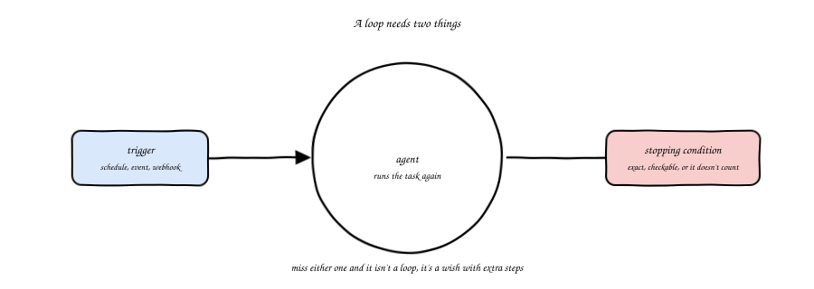
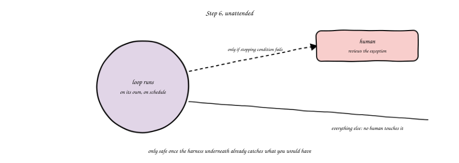
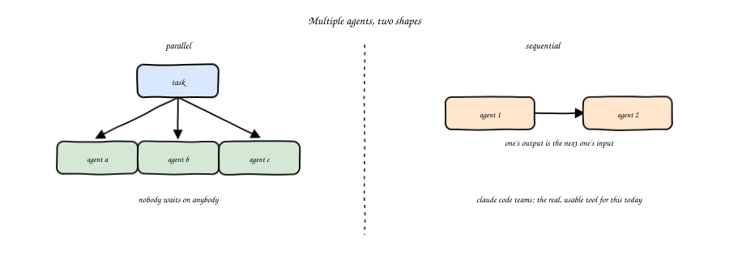
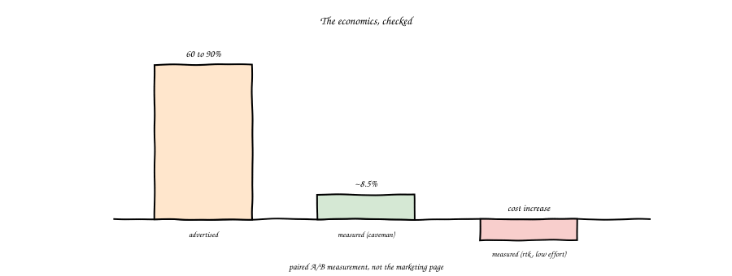

import Slides from '@site/src/components/Slides';

# Chapter 12: Loop Engineering, Multi-Agent Ops, Economics

<Slides src="decks/m12-loop-multiagent-economics.html" title="M12: Loop Engineering, Multi-Agent Ops, Economics" />

## Recap: The Third Layer Was Always Open

Go back to module one. Three layers, one diagnostic. Context: the agent can't get one task
right at all. Harness: it ignores your team's standards. Loop: you babysit every single run.

Module three built context. Modules four through eight built the harness, piece by piece: a
skill, a live connection, a hook, a full assembled system. Nine of the twelve modules in this
course, and the loop was still untouched.

This chapter builds it. Not because it's harder than the other two layers, it's actually the
smallest of the three. It's last because it's the one layer you should never build first. A
loop repeats whatever sits underneath it, mistakes included, faster than a human would. Build
it on a broken harness and you get more damage, sooner. Build it on what modules three through
eight actually gave you, and the loop is the easy part.

## A Loop Needs Two Things

Would you call a script that runs once, does something useful, and stops a loop? No. A loop
needs two pieces, and it's not a loop if either one is missing.

The first piece is a trigger, what starts the agent running again. A schedule: every night at
two in the morning. An event: a new pull request opened. A webhook: some other system says
"go." A file change: something landed in a watched directory. Pick one, and be specific about
it. "Whenever it seems like it should run" is not a trigger, it's a wish.

The second piece is a stopping condition, and you already met this one, back in module one.
"Stop when terraform plan shows zero changes and checkov exits clean" is a real stopping
condition, a machine can check it without asking anyone. "Stop when it looks good" is not, no
machine can check "looks good," which means a human ends up checking it anyway, and now you
don't have a loop, you have a script with extra steps and a false sense of automation.

Miss the trigger and you have a stopping condition with nothing to restart it, a single good
run that happened once. Miss the stopping condition and you have a trigger with no exit, a
process that runs forever or until someone notices and kills it by hand. You need both, every
time, or don't call it a loop.

## Step 6, Unattended

Here's where the autonomy ladder from module one finally closes. Step 5, supervised autonomy,
a human reviews outcomes, not every single run. That's what module eleven's lab actually built:
a pull request gated automatically, merged by a human, reconciled by Argo CD without anyone
touching `kubectl` again.

Step 6 goes one step further. A human reviews exceptions, not outcomes either. The loop runs,
and runs, and runs, and a person only shows up when the stopping condition fails to trigger, or
when something the harness itself flags as unusual happens. Would you hand that much rope to a
system you built last week? Probably not, and that instinct is correct.

Step 6 only works because of what came before it. A complete harness, from module eight,
catches the mistakes a human would have caught. A real pipeline, from module nine, blocks what
shouldn't ship. A real gate, from module six. Without all three already solid, "unattended"
just means "unsupervised," and that's not a step up the ladder, it's a step off the edge of it.
This course never teaches step 6 as the default. It teaches what has to be true first, and lets
you decide, task by task, whether that bar is actually met.

## Multiple Agents, Two Shapes

One more idea before the numbers. Everything in this course so far assumed one agent, one task.
Real work doesn't always fit that shape.

Two patterns cover most of what you'll actually need. Parallel: several agents work
independent pieces of a bigger job at the same time, nobody waits on anybody else. Sequential:
one agent's output becomes the next one's input, a pipeline of agents instead of a pipeline of
scanners. Claude Code teams is the real, usable tool for this today, multiple agent sessions
coordinating on one shared piece of work. Hermes is a name you'll hear if you keep reading past
this course, it points at where multi-agent orchestration is headed. This course doesn't teach
it. Remember the name, come back to it later.

## The Economics, Checked

Every claim in this course about a tool's numbers gets a source and a caveat, remember module
one's four traps. Here's one more, about the thing that actually determines whether any of this
is worth running at scale: token cost.

You'll see tools advertise sixty to ninety percent savings on token usage. That's the number on
the marketing page. A paired A/B measurement, actually running the same tasks with and without
the tool, found something different: roughly eight and a half percent measured savings for one
such tool, and for another, rtk, an actual *increase* in cost at low reasoning effort settings.
Not a smaller saving. A cost increase.

Would you trust a vendor's own benchmark for a security scanner without running it yourself?
You already learned not to, back in module nine, when Trivy and Checkov gave you two different
answers on the same code. Token-cost tooling deserves the exact same skepticism. Ask for the
measurement, not the marketing page. Run your own paired comparison before you standardize a
team on any tool that claims to save you money by changing how it talks to a model.

## Closing the Ladder

Six steps, one more time, together, before the capstone.

Step 1, suggest: the agent proposes text, you type it. Step 2, draft: the agent writes files,
you read every line. Step 3, propose with plan: code and a plan together, you read the plan.
Step 4, gated apply: automated checks plus your approval, both required. Step 5, supervised
autonomy: the agent loops on its own, you review outcomes. Step 6, unattended: the agent runs
to a stopping condition, you review exceptions, and only once the harness underneath it has
earned that trust.

Every step needs the gate beside it, that hasn't changed since module one. What's changed is
you've now built every layer that makes a real gate possible: context, a full harness, a real
pipeline, real GitOps, and now the loop itself. The capstone is where all of it gets used on one
project, end to end.

## Vocabulary

| Term | Plain meaning |
|---|---|
| Loop trigger | What restarts the agent: a schedule, an event, a webhook, a file change |
| Stopping condition | The exact, machine-checkable rule for when a loop quits |
| Step 6, unattended | The agent runs to its stopping condition, a human reviews only exceptions |
| Escalation | What happens, and who gets told, when the stopping condition is never met |
| Multi-agent orchestration | Several agents working one job, in parallel or in sequence |
| Claude Code teams | The real, usable tool this course points to for multi-agent work today |
| Hermes | A name for where multi-agent orchestration is headed, referenced once, not taught here |
| Token economics | What running agentic work actually costs, measured, not advertised |
